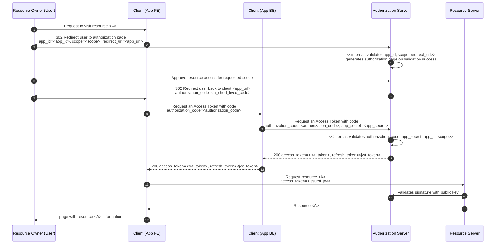

## OAuth2 - 是一种标准

先定义名词：
1. third-party application：三方应用，希望获取user在resource provider中存储数据的人
2. resource provider：用户真实数据的维护地，比如微信、百度等平台。在服务时序图中这个人一般也叫resource service
3. identify provider / identify service：在服务时序图中这个人一般也叫authorization server。Auth0即是一个identity service。在一般实践中，identity provider是独立的服务，而resource provider一般也是大型应用或公司提供的平台，这样让互联网世界的数据集中在少数大公司手中，并通过独立的授权层来获得数据。每个平台可以自己实现自己的identity provider，也可以用公开的服务来做
4. user：数据的拥有者，一般即是resource provider的用户，也是third-party application的用户
5. oauth：特指OAuth 2.0协议，它和OAuth 1.0完全不兼容

这个步骤里头：
1. client server需要注册什么信息？app_id, client_id, client_secret?
2. resource provider如何校验client server传过来的token？应该还是要跟identity server去集成。OAuth是否指定了API或实现方案？
3. [x] identify server / authorization provider是不是同一个人？- 是
4. [resource provider（一般也是一个支持多种登录方式的platform，比如微信百度等）需要跟authorization provider做多少集成？对于一般的应用来说，我要支持让别人访问我的数据，难道我还得做个OAuth？这就是Platform能提供的功能了。](https://zq99299.github.io/note-book/oath2/01/05.html#%E6%9C%8D%E5%8A%A1%E5%B8%82%E5%9C%BA%E4%B8%AD%E7%9A%84%E7%AC%AC%E4%B8%89%E6%96%B9%E5%BA%94%E7%94%A8%E8%BD%AF%E4%BB%B6)
    1. 需要在identity service注册，一般包括name, client_id, authorization callback url
    2. 需要实现authorization callback url：input是一个code，output是带上这个code+client_id去identity server请求一个token
    3. 需要实现get token API：接收前端的code，加上后端的client_id和client_secret，一起去identity service换一个token给前端
    4. 需要实现授权切面，支持：1）调用identity service验证token；2）从access token中获取授权信息，即用户权限信息
    5. identity service一般用买的，像Auth0。只不过Auth0除此以外还提供了用户信息管理等东西
5. [-] access token有什么约定俗成的format嘛？权限信息如何在access token中携带？
    * 一般可以是JWT token，也可以不是。只要#4.4.2中能获得授权信息即可。
    * 如何携带？[根据这里](https://zq99299.github.io/note-book/oath2/01/02.html#%E6%8B%93%E5%B1%95%E9%98%85%E8%AF%BB)，token中带的信息一般是`app_id+user_id`，可以通过解析（是否需要identity service参与？）拿到`user_id`，然后再进一步查询权限数据
      * scope是OAuth的东西吗？要identity service支持配置吗？是不是通过这个东西来看权限？那API权限都放到这个scope里？
6. client/server如何让access token和登录用户绑定？

highlight：

1. 用户未获得授权时，跳转的授权页面一定得是authorization provider服务提供的，不然不造假么
2. 用户在#1中授权后时，一般在这个页面会配置一个redirection url到client server，带一个code，这个code一般时效很短，10分钟左右过期；client server凭借这个code和提前申请的app_id，client_id等信息向identify server再申请一个access token/refresh token
3. 一般identify service会有类似Auth0这样的工具，你的服务要集成OAuth，就必须向它申请一个client_id之类的。但当然，你resource provider也可以实现自己的authorization server，只要你实现几个接口。
4. 现在看来，Serai的认证方案就是OpenID Connect，我们是拿id_token（一个JWT token）获取用户信息
5. 一些OAuth参数：
  * grant_type: AUTHORIZATION_CODE 表示使用授权码模式。
  * code: <授权码本身> 表示使用授权码模式。
  * client_id: <> resource provider提前在identify provider那里注册的id。一般每个服务都需要向identity service申请
  * client_secret: <授权码本身> 表示使用授权码模式。

## Thoughts

* 另外，在OAuth中使用JWT（本身不是必须），就意味着使用了分布式无状态的架构思想（节省数据库开支）。因此，revoke AT违背了这种思想。然而本质问题并没有解决，引入RT相当于必然也在AS端引入状态存储（因为要记录只能用一次）（不过AC的存在也已经注定AS端必然有状态了）
* 你在使用京东OAuth时，RS指的是京东的服务API还是你自己软件的后端API？应该是前者吧。也就是说，如果你的资源暴露出去你自己想加权限验证，那么你就得接入某个OAuth开放平台，接入哪个就支持三方应用通过这个平台跟你集成。
* 极客时间使用微信登录是怎么做到的？这是认证而不是授权吧。那么这就是SSO了。SSO和OAuth什么关系？简单来说，SSO包含了认证+授权，SSO方案中的授权部分仍然可以基于OAuth来做；SSO只是一种方案和思路，连协议都说不上，而OAuth是一种协议。

## What I have learnt

* OAuth几大重要元素：AS、RS、RO、Client。其中AS、RS是一伙（凭证共享、公钥共享），Client、RO是一伙（主要完成授权动作）
* OAuth解决的问题：本质上是一个授权协议，不涉及认证（用户必须在AS上认证后才能进行授权）。解决授权时暴露三方用户名密码、永久权限难以收回、授权资源无法进行细粒度控制等问题
* OAuth的运作原理：有好几个授权模式，最常用的还是Authorization Code模式。流程图见下。几个关键点：
  * 为什么要有AC而不是直接给出AT：便于重定向、减少攻击风险
  * 为什么用了JWT难以回收权限：这是由JWT无状态本质决定的，只能通过密码与秘钥绑定或引入秘钥管理等额外方案解决
  * 如何将AC与用户和应用进行关联：AS颁发AC时校验`app_id`(由Client给出)和回调地址必须在AS备案注册过（即只要你有`app_id`就可以请求AC）
  * 如何将AT/RT与用户和应用进行关联：AS颁发AT/RT时校验AC合法性、`app_secret`必须在AS备案注册过，成功后AT/RT即可与用户和应用唯一关联
  * AS颁发AC时校验`app_id`(由Client给出)和回调地址必须在AS备案注册过；
* OAuth安全的核心因素：Access Token不能失窃。因为这玩意无状态，“If I have your token, then I am you” - Mike
* JWT的作用：信息自包含、无状态。解决的是为了验证颁发出去的AT（随机字符，不包含与用户、应用、scope的绑定关系）需要存储的架构
  * 解决办法就是把这东西写到JSON里头，并通过AS上的私钥签名即公钥服务解密，这样就把一个存储问题变成了一个计算问题
  * 好处是信息自包含、无状态架构的易于横向扩展、无需状态存储等，把用户（sub）、应用（aud）、授权范围（scope）信息存储到了JWT中，使用简单
  * 缺点是签发出去的JWT只能等它自动过期，无法人工回收，应对不了用户更改密码需要马上回收AT/RT的需求，只能通过解决额外的秘钥管理方案来解决
* OAuth的其他认证模式：
  * `password`：密码认证模式。一般用于三方软件和AS是一家人的场景（比如说应用和插件），不存在密码暴露顾虑，因此直接用密码登录就能换AT
  * `client_credentials`：一般用于请求非用户特定资源的场景。此时没有RO了，AC也是不需要的了，直接在Client发起请求换AT即可。同时，因为请求是直接从Client的后端发出的，也就不存在过期一说了，因此这种场景下不需要有RT，`/token`也不会返回RT
  * `implicit`：隐式模式。一般用于你的应用直接嵌入浏览器、没有后端的场景。因为全在前端，没有保密的可能了，因此也不需要`app_secret`就能换AT了。基本上只要你的App在AS侧注册了就行
* JWT的加解密算法及原理：利用的是非对称加密算法（RSA256）和哈希算法（SHA256）。JWT的签名部分`signature=RSA256(SHA256(header.payload), privateKey)`。使用哈希算法SHA256的原因是其可重复性，AS和RS都能够根据公开的算法和JWT生成一致的简短的哈希作为校验基础；使用RSA256是因为其私钥加密公钥解密的非对称特性，公钥可以在分布式系统中随意分发；使用RSA加密哈希而非原文的原因是RSA算法性能有限，直接加密原文性能吃不消。
* 增补协议PKCE：2015年发布。主要目的是减轻授权码模式里头AC被截获的安全风险，因为这块的传输不一定有TLS加密。主要的防偷手段跟签名原理差不多：加上哈希签名的`challenger`/`verifier`。`challenger`因为哈希加密的不可逆性不怕失窃，`verifier`只能用一次+Https大大降低被偷风险。OAuth 2.1还推荐使用PKCE取代`implicit`/`client_credentials`两种认证类型。但PKCE并不是在解决OAuth的核心安全风险：AT失窃。
* 安全是个成本问题。Web风险的本质在于分布式系统的客户端难以保证完全不受攻击。事实上，就算你是单体，通过更加底层的操作系统也可以攻击你（只是成本更高）。本质上，只要存在网络连接，就存在更低成本的、更多样化的攻击方式。真正的分布式安全是网络引起的，而不是简单的BS/CS这种狭义理解
* 其中一个重要的安全防护思路，就是将风险点（被攻击点）从被攻击成本低的地方转移到攻击成本更高的地方，比如PKCE把对暴露在不安全网络环境中的AC的攻击，转移到攻击成本的位于内存中的CV等；另外就是增加攻击者的计算成本、计算时间咯。

> 有时候App BE会由一个独立的认证服务来提供；有时候App BE和RS可以是同一个服务。

## 授权方案：RBAC

## 术语

AS：Authorization Server（中文译名：授权服务）。AS一般要实现OAuth协议，它同时一般也是资源（用户信息）持有者，比如京东、微信等实现了开放平台的大玩家。没有数据就没有成为AS的资格

RS：Resource Server（中文译名：资源服务。不要管中文译名）。一般是你自己的服务后端，要访问AS上的资源。RS必须先在AS处进行注册才行

RO：Resource Owner（中文译名：资源拥有者）。一般来说就是用户自己，需要你授权RS使用AS上的资源（比如用户数据、订单数据等）

Client：一般是一个可以与RO交互的UI咯，比如Web App、微信小程序等，主要作用用来将RO引导到AS提供的授权页面、完成授权动作

AC：Authorization Code（中文译名：访问令牌。不要管中文译名）

AT：Access Token（中文译名：访问令牌。不要管中文译名）

RT：Refresh Token（中文译名：刷新令牌。不要管中文译名）

## 问题

* [x] SAML和OAuth什么关系？答：SAML是10-15年前基于cookie的登录和SSO方案；OAuth是SPA和多客户端出来后用户认证和SSO的基础协议；（多客户端不支持浏览器cookie）另外还有类似Kerberos的方案，也比OAuth2复杂。
* [x] JWKS和OAuth什么关系？答：JWKS是OpenID Connect的实现方式，OIDC是OAuth的扩充协议
* [x] OIDC和OAuth什么关系？答：OAuth用于授权Authorization，OIDC用于认证Authentication。但OAuth是OIDC的底层协议，OIDC没法脱离OAuth存在。OIDC --> OAuth2 --> HTTPS
* 在OAuth2里，如果access token不能为前端所拿到，那么前端拿什么去调后端？client server如何校验access token？还是得通过identity server吧？
* Access token是否必须是JWT格式？答：OAuth协议未做强制，但建议用JWT。理由是：结构化数据、计算预先存入数据以节省多余的远程调用、无状态（缺点是不可撤回）
  * Serai的实现是拿到一个access token是JWT，前端只用到了里头的expiry字段来做refresh。然后后端会通过这个token拿到
* 做SSO有哪些方案？OIDC / OAuth / SAML / CAS
* OAuth里头的AT说敏感性最高，但是这玩意儿最后也放在前端了啊？Mike 说了，“if I have your token then I'm you”
* 因为AT发了就没办法回收所以必须设置较短的过期时间，然后为了解决频繁过期带来的体验问题又整了个RT，RT的有效期比AT长，通过RT来频繁透明地刷新AT。然而AT怕偷RT就不怕被偷么……？RT被偷了还是相当于获得了一个很长期限的AT啊。我不理解。有人提到几个观点：
  * RT可以revoke，从而实现对AT的收回控制。然而你能revoke RT为啥不能直接revoke AT呢……
  * RT可以限制只能用一次，而AT没法限制。虽然没法防止被盗，但是被盗了客户端可以马上知道……？这还有点说得过去。但总觉得还是哪里不对
* 一个app能用OAUTH获得多个app的授权吗？
* OAuth 2如何在移动端上实现呢？比如说你微博要接入微信开放平台？OAuth方案中的callback url跳转在App中有方案吗？
* SSO又有啥方案呢？CAS？SAML？

## Referencing 

* 
* 
* 
* 
* 
* [OAuth](https://oauth.net/articles/authentication/)
* [OAuth RFC](https://www.rfc-editor.org/rfc/rfc6749)
* SSO:
  * 
  * 

## To Read

* 
* 
* 
* 
* 
