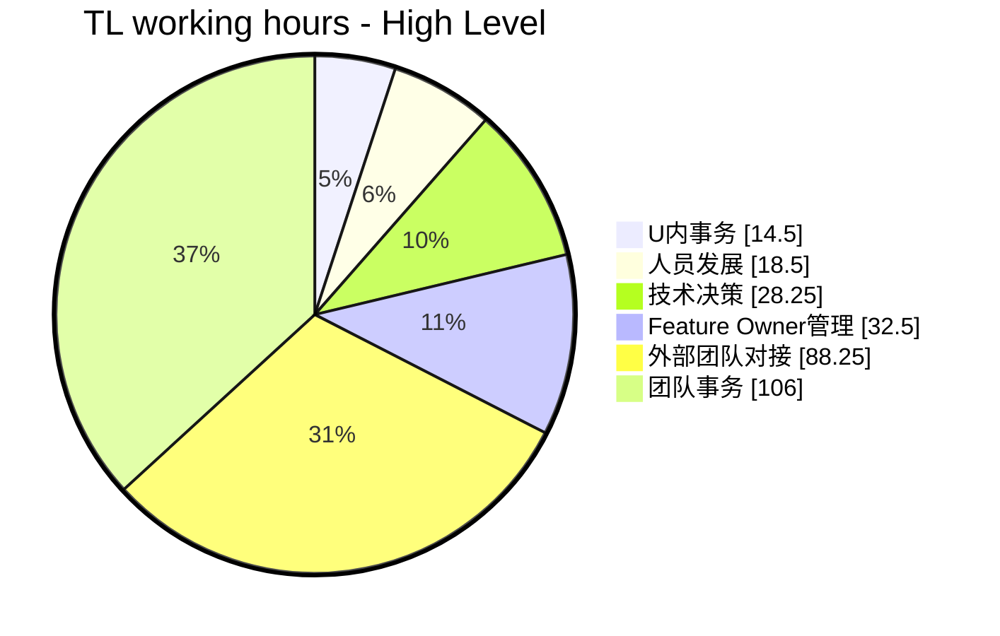
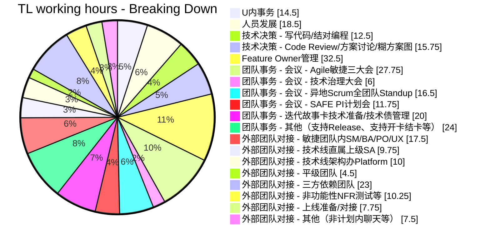

数据证明，只有10%！

在我入职TW的时候就对TL这个工作有一种神圣的敬意，觉得TL是团队里的全能小英雄，也是身为技术人的技能巅峰。在我的心目中，TL就是组里技术最强的人，TA不仅能带团队高效地交付高质量的功能，也能打点好跟上级和其他人的沟通，组里的一切TA都可以游刃有余。用大熊的话来说，就是当项目经理把这个项目交到你手里，他就啥也不用操心了，因为相信你一定会把项目管好。但是我发现，当我两年前真正戴上TL这顶帽子的时候，我却蕉绿了！其中最核心的困惑点还是，各种纷杂的事务扑面而来，许多事情需要响应，我写代码的时间不可避免地变少了。

变得有多少？通过精准的时间记录，我可以明确地告诉大家，这个数字是**10%**。准确来说，是9.8%，10%不到。

## TL日常工作时间一览

记录工作笔记并且经常回顾，是对日常工作一个有益的尊重。正如developer记录编码时间可以发现自己编码过程的生涩点并加以刻意练习提高一样，TL记录工作时间同样有助于发现自己的工作侧重及生涩点，并加以有益的练习和提高。于是，我抓取了自己最近三个月来的工作日记，分析了一下自己日常不同工作类型的时间占比。采样点跨度三个月，共12周、41个工作日，采样时长288个小时，刚好经历一个完整的三个月一次的SAFE大迭代计划会，以及TW内部每半年一次的绩效评估。

[](https://mermaid.live/edit#pako:eNqFVF1T00AU_SuZzPQN-wlUeSsiM86odIioD3lZ6UIztEkn3VicTmdasQWCiKjtoECxigM-0IoIQlrhx5jdpE_8BTcfti8QXzLZs_ece--5dzbPTksJyI6wPl9eEAU0wuR5NiNAnrX_EJxHcSkrIEESLSjoHxpgeFbJwsdCAiUtKBQJBQsWiJIwDR8BWQBPUzDrClCpCQVBmUOyNNcn8WwkM8-zhQJT8Pl4kUYx2aSUGwMIMEhAKcg8vMfkJHlOEGeZpKTIWeYGMypDYANjUk7kRYaqTOFKWddWsNqwSxn0Dzm4rml4fQOvrePDqn1z898NUYtkq4UrR8ZBjWriyge9_cX4VAoY7Xe4dWZ0asb-ik0JX0O5TQ1jJuEzAeYCpHZGGktmc99sagHjSHXOePPcVhjyR12JcQiQIkNmIidC2Wg2jDcVKyLSy4E3P3c3dpxWaA6989FsNulPbFZIQVJdI6u_9NNlvLtHbyxmONrTvo7qlE1-tGmyPnHYm4Q7L_DWd25aVtK4vO9EcQiICSVjtzT8v4K52PgdJn7XbDbw0ls3Zyh0XbHmxQG1n1TtIa42XKcXab2LAfdQ1Pp-hYNXquDyid6uXXaWyPsWeVWahCkIsvBPseSccadIta350u_B8mVn2dYadLV2a90Ft1O6AOT1V8s723EXrJS5-4HRWCA-EZh6YvcT7blwJdku3NAujM2f-LCun6qGtsfFLOatvhGeTFI_IfWXWK3HUwDNSHLaThv0oOKzI5rFAa3gQc8S6S7RVdXPt83jWp8TjnhQutt1rO6YC79Jce_B-CQ5XjFbVWqnU5k_7J2OWnDhztVBLVrU243eWGlqZ5_oKMySine_9cdIR8EOsGkop4GQoO9Y3hG0HyPnpUnAGaCkEM_yYoGGAgVJ3HNxmh1BsgIHWCWTAAiOCWBWBmkHLPwFK5l9tQ)

WIP: 待解读

参考：
* [关于时间管理的一点建议](https://juejin.cn/post/7225941608225652773)
* [Tech Lead如何应对编码时间下降](https://zhuanlan.zhihu.com/p/518921041)
