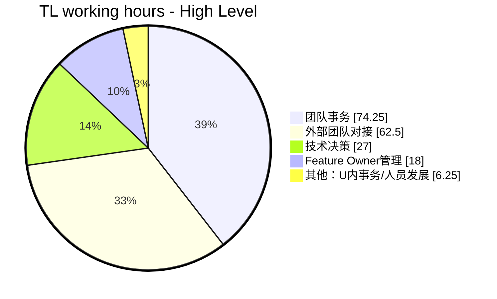
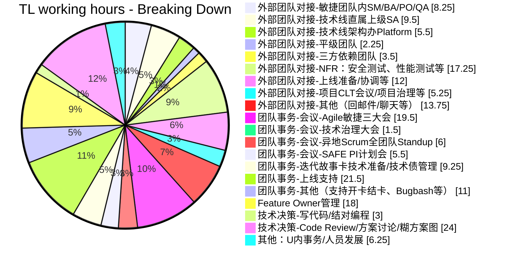

占个坑，讲时间管理。

本文仍然是草稿阶段。

为什么要做时间管理？

## 时间管理

这块的时间管理框架是什么？有两种提法，一种是按紧急/重要四象限来，一种是按照时间分类来。时间分类的做法是这样：

* 老板分配的任务：关乎你的KPI，你必须做。当然，未必老板发的任务都是KPI相关（那不成人身依附了么），要判断
* 同级同事的任务：一般也需要尽快响应。比如作为TL，响应PO、Core Team、其他团队的请求等，哪怕转交也尽量第一时间回
* 下级寻求帮助/决策的任务：这里的处理方法就比较多了。对于TL来说，一般是指团队内事务。这里再按照尚奇的主动性程度分：
  * L1 等待着被告知要做什么事：要么就是要甩锅，要么就是态度不好，直接开骂，让他自己去搞清楚
  * L2 主动询问要做什么事：可以coaching一下，如何分析要做的事情及优先级，然后下次如果还问就开骂
  * L3 已经开始行动，但可能需要一些支持：帮助他定位到合适的人，如FO/ST。如需要自己决策，则参与
  * L4 不仅行动起来，而且对行动计划有所建议：帮助review、给予反馈，帮助调整方向，并确定下次catchup时间及输入
  * L5 有条不紊地安排行动、解决困难，仅做汇报：听取汇报，给予更高层次的建议
  * 总体来说，TL在使用FO这样的leverage机制时，必须根据成员成熟度决定好行动计划、时间表、实施进程的验收节点，主动管理下属的工作进程。在这种情况下，这部分团队管理的时间只能说是尽量优化使其高效，并不能完全砍去
* 自己可以分配的时间：应该投入在对团队最重要、最有价值的事情上

此外，应该还有一些指导原则：
* Optional的会直接不去，会后看会议纪要输出的信息就行，除了少数情况你判断你必须去之外。
* 问了之后还是没有详细agenda、你不知道你要做啥输入的会议，直接提出建议并拒绝。
* 价值判断，实则也是个玄学问题，依赖于TL自己的个人风格了。很有意思的。
* 一些例子：
  * 紧急重要：下个迭代的故事准备、技术方案设计和拉通、领导安排任务 —— 马上做，同时采用不紧急重要的buffer来长远解决这些隐患
  * 紧急不重要：线上事故、迭代交付风险、多角色协作（协调其他团队问询、CT沟通） —— 马上响应，但工作可分派或委托
  * 不紧急重要：测试策略（提高质量）、团队能力建设（提高效率）、开发流程优化（团队效率提升）、风险管理 —— 争取时间按优先级逐步实施

## 改进武器：PDCA

[PDCA][pdca]是Plan-Do-Check-Action的缩写，是一种常用的过程改进方法论。真正的改进过程发生在Check（检查）这里，意思是在工作完成之后对特定的过程数据进行检视、发现改进点，并为改进点制定改进目标和Plan（计划），然后再次执行、并重复这个过程不断改进。

过程数据的采集需要或自动或手动的介入，改进点和改进目标的详略程度视不同工作类型也可不同。正如我在[第一篇的“时间都去哪儿了”一节中][My Tech Lead journey I]所展示的，我选择的过程数据是TL的工作时间分配数据。

在[上一个季度的工时分配][My Tech Lead journey I]中，我发现我花费在编码和技术上的时间太少了，只有10%。本质上TL的工作离不开技术，不管是为了技术精进、团队管理或是更好输出技术影响力，增加技术时间投入都是必须的。因此，我给自己Q3的一个改进目标是：将投入到技术相关的时间提升到30%。为此，我需要检视其他90%的用时，想方设法从其中压榨出20%的时间。于是我就这样得到了一份Q3的改进计划：

* Feature Owner管理 ↓4%：①选择owner时更加注意个人兴趣与能力匹配；②多派活，适当减少对无关细节的关注，只验收关键节点
* 外部团队对接 ↓4%：①同样可以Feature Owner机制带动起不同的人去跟，验收关键节点即可
* 迭代故事卡技术准备等 ↓3%：①同样通过Feature Owner机制将需求等事务分出，验收关键节点（方案可行性、卡片AC有效性等）
* 全团队与PO每日同步会 ↓2%：①减少出席，提前关注agenda，不需要关注的不去；②功能相关的话题仍让Feature Owner代表参加
* 上线支持 ↓4%：①通过Release Owner+结对等机制让团队每个人都能干，从而减少TL投入时间及关注
* 其他杂务 ↓3%：①Feature Owner用活后，期望一部分开卡结卡的事情可以让团队成员找到Feature Owner去担任；等

这些改进方向都是实打实且可度量的。虽然说压榨时间的方式主要是在团队内找到其他owner来承担对应的事务~~怎么看起来唯一的方法就是压榨owner~~，但是对这份时间统计进行分析，我们意外地可以得到一些洞见：

* **对Feature Owner的期望是跟着TL的工作方式走的，进一步讲即是由项目环境决定的**。在笔者当前项目上，owner需要做的事情可以从上面完整地看出来：上至需求管理与技术方案输出，对内要关注团队内部的开结卡流程，对外要与PO与三方团队对接，同时还要与TL定期同步信息等。这又回答了第三篇的问题：我们需不需要Feature Owner，以及他们的职责是什么。
* **对于TL来说，你如果没法亲自高效完成开发者们（甚至团队其他角色）都能完成的事情，那么你就做不好实质性的领导**

那么，遵照这个时间管理的方向，我在Q3的进步如何呢？我把Q3和Q2的用时情况进行了对比。感兴趣的读者，可以展开后面的工时细节查看原始的数据。

  

从这个对比图中，我们不仅可以看出改进的效果，同时还能看到各个类目用时的变化过程，并再次从中得出有益的洞见：

* 技术相关的事情从原来的10%→到14%了。确实是在改进中的，但是改进的速度并没有想象中那么多、那么快。
* 外部团队对接、全团队与PO每日同步会、迭代故事卡技术准备、Feature Owner这几个类目都是达到了效果的，一共砍出来12%的时间
* 为啥这12%只有4%落到了技术相关事务上呢？主要是因为Q3是团队第一次上生产环境，安全测试有很多问题要跟进，然后团队是第一次上线缺乏经验、有很多会议要协调，这两个部分分别增加了6%、10%的时间占用。读者如果对数字有所敏感，就应该知道任何超过10%的时间都意味着一段时间的密集投入
* WIP 你会发现你想争取20%的时间移交到技术侧，那么必然是这里出4%，那里出2%，翻译一下，就是每个月从一个类目时间里提高2-4个小时的时间效率的事情，所以，不要看不起30分钟粒度的效率提升。看似微不足道的数字里头（2%这样的改进），其实包含了许多实打实的改进。这个视角看数据更有敬畏感，很有意思。
* WIP 由于TL的工作时间粒度往往是以25分钟作为单位的，你不记录时间，就很难精确知道究竟是哪些地方用时多了，也很难做出基于数据的改进。当然了，定性地确定改进方向行不行呢？
* 几个改进方向：过度关注细节、事务不熟悉导致用时增加 -> 加强学习、效率不高导致用时增加 -> 刻意练习。

  
点击展开Q3工时细节

> TODO：Q3时间最终定下来之后，本篇的图也需要更新一下

## 其他疑问

* 习惯性分配工作，那么TL究竟干哪些活？
* 如何管理自己的时间？没有学习技术或编码的时间、担心降低自己的长期竞争力怎么办？
  * 为何一定要写代码？只有做一个story，只能感受到全流程、架构和测试策略是否适用；没有调查就没有发言权；切实了解团队能力和代码质量；
  * 写什么样的代码？项目的架构代码、底层核心代码（少有这样的核心）（前两者一般在项目启动前期有机会写）、故事全流程代码、小巧无依赖的Story、想学习技术栈的Story等；
  * TL写代码时间减少，如何保持技术输出？掌握新技术直到足以使你保持技术判断力的程度（方案选择标准是什么、CR建议针对性、问题定位、能做工作量评估）、保持技术关注度（以能达到选用不同的技术栈完成不同的项目）以提升技术见识和品位，做出必要的技术创新
  * 如何挤出时间来？世纪难题。加班，使自己的学习方向与项目方向一致，则加班=学习精进；
  
#### 参考

* [关于时间管理的一点建议](https://juejin.cn/post/7225941608225652773)
* [Tech Lead如何应对编码时间下降](https://zhuanlan.zhihu.com/p/518921041)

[pdca]: https://zh.wikipedia.org/wiki/Special:Search/pdca
[toggl]: https://toggl.com
[My Tech Lead journey I]: https://ethan.thoughtworkers.me/#/post/2023-08-01-my-tech-lead-journey-i
