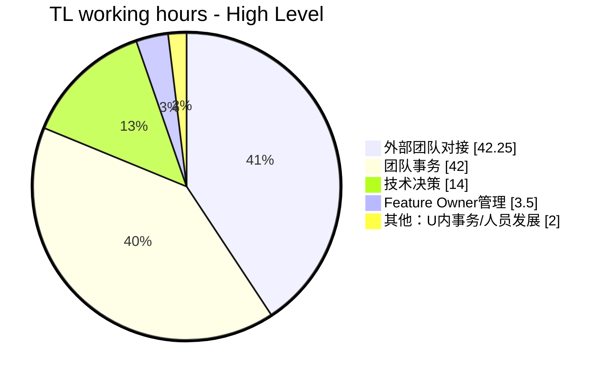
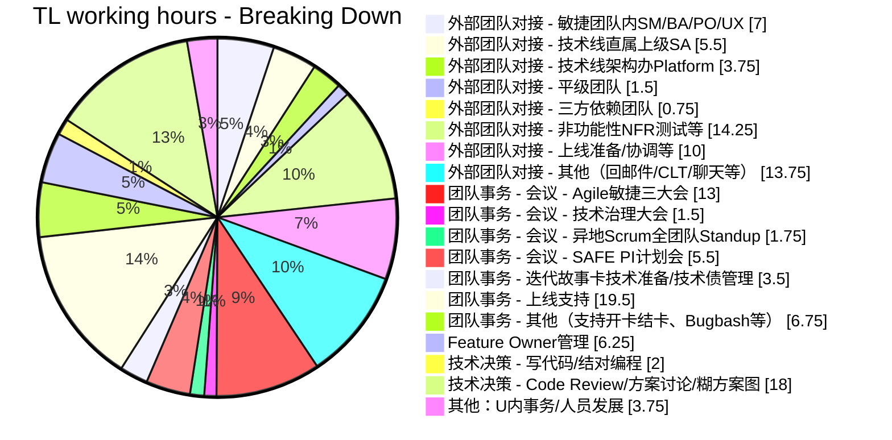

占个坑，讲时间管理。

本文仍然是草稿阶段。

## 时间管理

这块的时间管理框架是什么？有两种提法，一种是按紧急/重要四象限来，一种是按照时间分类来。时间分类的做法是这样：

* 老板分配的任务：关乎你的KPI，你必须做。当然，未必老板发的任务都是KPI相关（那不成人身依附了么），要判断
* 同级同事的任务：一般也需要尽快响应。比如作为TL，响应PO、Core Team、其他团队的请求等，哪怕转交也尽量第一时间回
* 下级寻求帮助/决策的任务：这里的处理方法就比较多了。对于TL来说，一般是指团队内事务。这里再按照尚奇的主动性程度分：
  * L1 等待着被告知要做什么事：要么就是要甩锅，要么就是态度不好，直接开骂，让他自己去搞清楚
  * L2 主动询问要做什么事：可以coaching一下，如何分析要做的事情及优先级，然后下次如果还问就开骂
  * L3 已经开始行动，但可能需要一些支持：帮助他定位到合适的人，如FO/ST。如需要自己决策，则参与
  * L4 不仅行动起来，而且对行动计划有所建议：帮助review、给予反馈，帮助调整方向，并确定下次catchup时间及输入
  * L5 有条不紊地安排行动、解决困难，仅做汇报：听取汇报，给予更高层次的建议
  * 总体来说，TL在使用FO这样的leverage机制时，必须根据成员成熟度决定好行动计划、时间表、实施进程的验收节点，主动管理下属的工作进程。在这种情况下，这部分团队管理的时间只能说是尽量优化使其高效，并不能完全砍去
  * 另外，作为领导，你如果没法亲自高效完成下两级成员都能完成的事情，那么你就做不好实质性的领导
* 自己可以分配的时间：应该投入在对团队最重要、最有价值的事情上

此外，应该还有一些指导原则：
* Optional的会直接不去，会后看会议纪要输出的信息就行，除了少数情况你判断你必须去之外。
* 问了之后还是没有详细agenda、你不知道你要做啥输入的会议，直接提出建议并拒绝。
* 价值判断，实则也是个玄学问题，依赖于TL自己的个人风格了。很有意思的。
* 一些例子：
  * 紧急重要：下个迭代的故事准备、技术方案设计和拉通、领导安排任务 —— 马上做，同时采用不紧急重要的buffer来长远解决这些隐患
  * 紧急不重要：线上事故、迭代交付风险、多角色协作（协调其他团队问询、CT沟通） —— 马上响应，但工作可分派或委托
  * 不紧急重要：测试策略（提高质量）、团队能力建设（提高效率）、开发流程优化（团队效率提升）、风险管理 —— 争取时间按优先级逐步实施

## PDCA

这里就可以看出记录时间的重要性。结合现状、TL职责，你可以发现哪些方面可以放手、哪些方面应该加强的。以自己作为例子写一写。

> 数据采集的目的，一是为了寻找洞见，二是为接下来的改进指明方向。比如，在上面的饼图细分中，我就发现了我在feature owner管理、异地全团队Standup（主要是跟PO Sync）、需求准备、外部团队对接方面还可以通过更精细地利用好Feature Owner这个杠杆来将更多工作委派出去，以此为自己争取更多时间来编码、与团队结对等。同时，本文完成后我仍然打算继续采集未来三个月的数据，并在这里做不定期更新。Q2和Q3数据做对比，相信我们能从中发现颇为有趣的TL工作洞见。

  

> TODO: 把CLT/项目治理这块单独拎出来profile。需要更新part 1和本篇的图表。

## 其他疑问

* 习惯性分配工作，那么TL究竟干哪些活？
* 如何管理自己的时间？没有学习技术或编码的时间、担心降低自己的长期竞争力怎么办？
  * 为何一定要写代码？只有做一个story，只能感受到全流程、架构和测试策略是否适用；没有调查就没有发言权；切实了解团队能力和代码质量；
  * 写什么样的代码？项目的架构代码、底层核心代码（少有这样的核心）（前两者一般在项目启动前期有机会写）、故事全流程代码、小巧无依赖的Story、想学习技术栈的Story等；
  * TL写代码时间减少，如何保持技术输出？掌握新技术直到足以使你保持技术判断力的程度（方案选择标准是什么、CR建议针对性、问题定位、能做工作量评估）、保持技术关注度（以能达到选用不同的技术栈完成不同的项目）以提升技术见识和品位，做出必要的技术创新
  * 如何挤出时间来？世纪难题。加班，使自己的学习方向与项目方向一致，则加班=学习精进；

#### 参考

* [关于时间管理的一点建议](https://juejin.cn/post/7225941608225652773)
* [Tech Lead如何应对编码时间下降](https://zhuanlan.zhihu.com/p/518921041)
