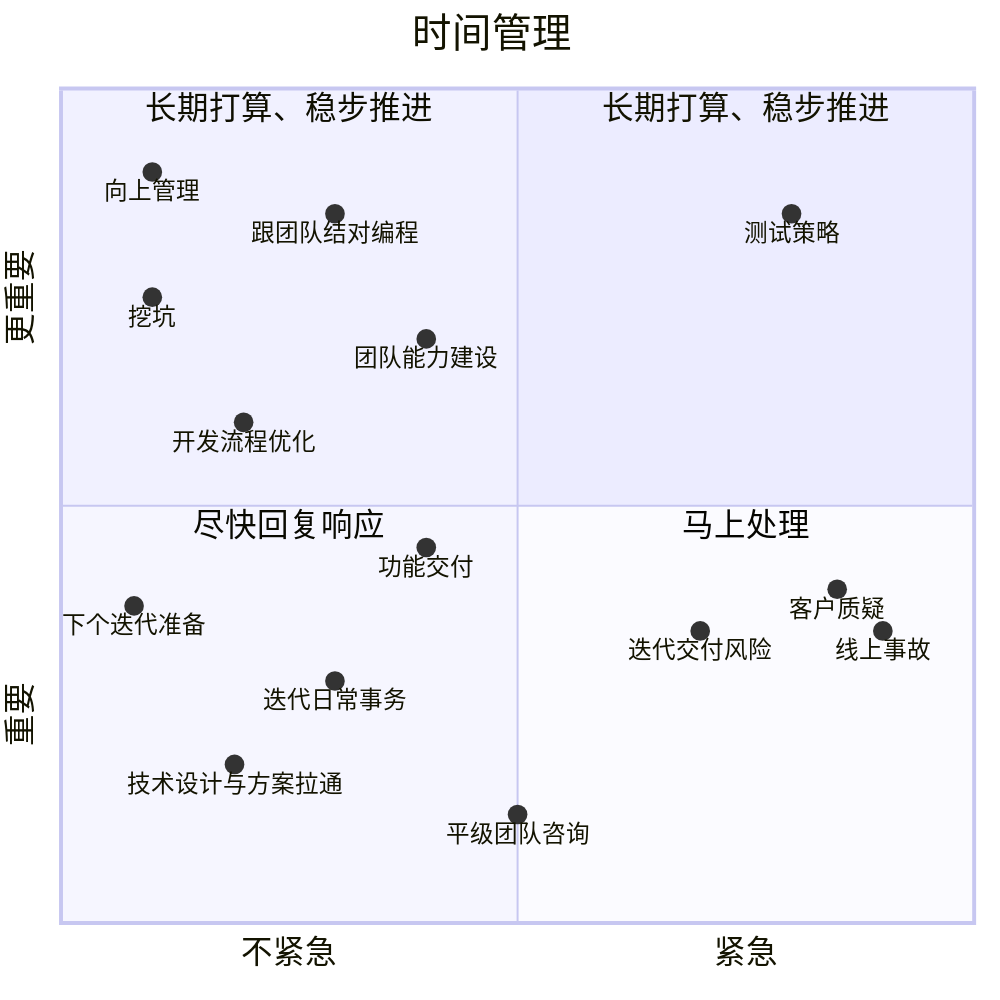
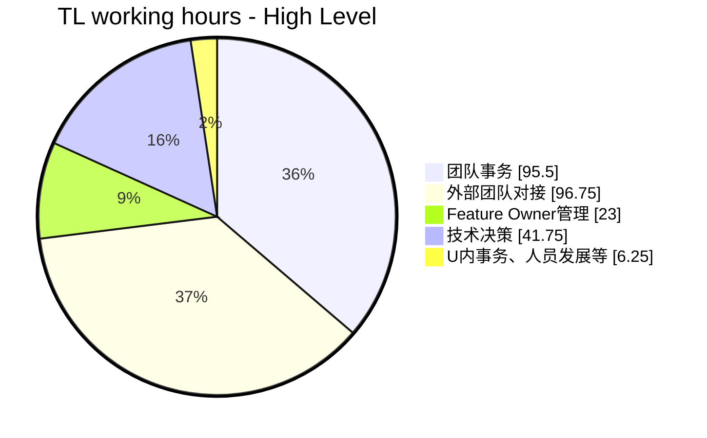
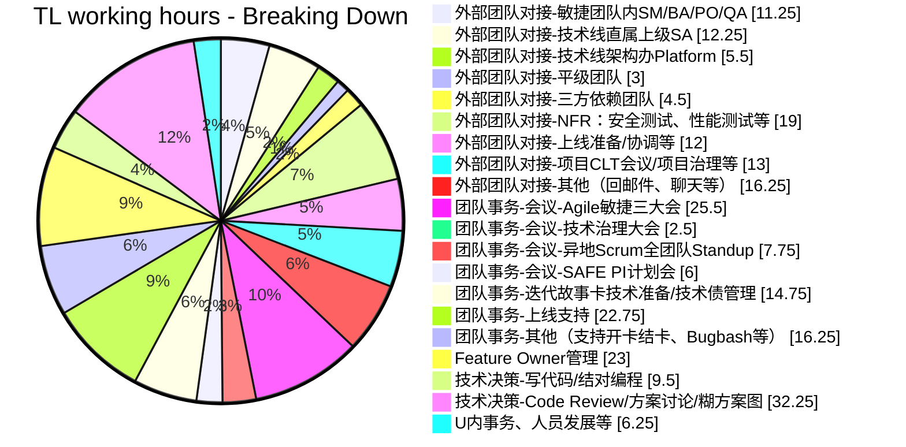

本文从“重要-紧急三象限”、会议管理、PDCA等几个方面，给出了一些详细且可落地的时间管理建议，可操作性很强。

为什么要做时间管理？对我来说，很现实的一个原因是为了控制焦虑感。一方面是从业几年之后，主观意愿上不如刚入行前几年下班之后所有时间都仍然投入在工作上；一方面是担任TL工作之后事务繁多，如果不主动做时间管理则必然导致写代码的时间在不自觉间被继续压缩。既不能无限加班，又想保证技术上的时间投入，那么就必然要求我有意识地对8小时的工作时间进行主动管理。

嗯，这里偏向于讨论工作8小时的时间管理。工作8小时以外做精细的时间管理效果是好是坏暂无定论，在此不表。

## 重要-紧急三象限

时间管理有不少框架和方法。有常见的重要-紧急四象限，有[这篇哈佛商业评论][Who's got the monkey]提出的看人下菜法。我觉得对我比较适用的方法是重要-紧急四象限，但是我喜欢简化事物，不喜欢动不动就是四象限，过于刻意。重要的事情就是重要，紧不紧急都该干，“重要且紧急”和“重要不紧急”象限我认为是可以合并的。因此，我正在践行的其实是重要-紧急三象限：

(Mermaid没法合并1、2象限。就这样吧。读者可以自行拆掉1、2象限中间的竖线分隔符)

### 重要

重要的事，往往是那些有挑战、但是能为团队甚至公司带来更高价值的事务，也往往需要投入更多精力去跟进。**做好时间管理的根本目标就是为了挤出时间，然后按一定优先级来全力推进这部分事情**。至于什么是重要的事，则取决于TL个人的价值判断，依赖于TL的个人能力和风格，也有赖于每位TL把这个问题想清楚。

对当下的我来说，我心目中的重要事项如上图所示了。先后次序细微难分，按下不表。但细心读者可以发现，这里重要的事情仍然很多。真正重要的事情一定很少，如果很多事情都重要，那么说明所有的事情都不重要。因此，时间管理的第一条心得是：

**你必须把大量可用的时间投入在少数的、但真正重要的一两件事情上，做细做好。为此放弃大量同样重要的事情是必须的。真正重要的事情永远只有少数。**

### 着急—紧急

广义上讲，“紧急”意味着有时间限制的任务，但不意味着一定火烧眉毛。紧急程度有高有低。因此，这里笼统地把今天、这周、当前迭代内（未来两周）需要处理的任务都归入“紧急”坐标。一定程度的紧急就意味着需要给予响应。在处理方法上来说，需要自己干的就自己干，其次可以优选让合适的团队成员来处理，既是工作分派，也是提升团队能力。当然，实际操作中要考虑更多的因素。

**在项目工作中，应该优先为有时限的任务安排时间，确保事事有人跟进**。比如下个迭代的需求跟进和技术设计、迭代中发现的问题或风险等。但同时，如果发现安排完有时限的任务后没有其他时间了，则意味着项目有某些重要的事务没有处理，导致它们变成了紧急的事项。那么在眼下救火之余，还需要识别出真正需要解决的重大问题，予以解决。
  
* 对于紧急的事务，适当的响应方式应该是：找到合适的人、合适的方式，马上处理。同时，要安排额外时间以长远地解决这些隐患。
* 对于着急但不那么紧急的事务，适当的响应方式应该是：尽快给出回复，具体事务可以找到对应的负责人响应。

> 看人下菜法的时间管理思路是，你的时间分配根据来源不同可以分为四类：老板找你的时间、平级团队找你的时间、管理团队的时间、自己的时间。分类的依据是KPI：老板找你不响应可能直接影响你升职加薪，平级团队找你不响应可能影响你绩效，团队你管得好坏相对不好衡量，自己的时间你就自己玩。
> 
> 我不喜欢这个思路。首先，一个工作值不值得做，还是应该看重要程度。不重要的事情，哪怕是老板找，也可以直接提出建议；平级团队找，也可以糊弄。重要的事情，团队找也应该花时间。再者，如果纯粹都KPI驱动了，那我还认真寻思把这工作做好？那不就是反正不涨薪，直接划水开摆了呗？

## 会议管理

作为管理角色，不可避免地有一部分时间要用于沟通：跟外部团队沟通以为团队排除依赖和风险，跟团队的其他角色沟通以统一认知、协调组内行动，跟其他干系人/管理者沟通以让组织内其他团队充分认知团队当前进展、需要解决的问题等……当你需要同时拉通的角色不止1-2个人时，你就需要通过组织会议来拉通所有人的认知。

但会议很容易变成时间杀手。为了让会议高效地完成沟通的目标，你需要很多基本功，比如[开好会议的5个C（我编的文章标题，还没写出来呢）]()，比如[高效沟通的技巧（这个系列的下一篇）][My Tech Lead journey V]等。不过这里，我们暂且把目光收缩到时间管理相关的话题上来。
 
下面是一些我正在使用的、我觉得对管控会议时间有作用的举措。时间管理心得二如下：

* **每周周一开始工作前，盘出这周已预约的会议及未安排时间，做到心中有数。然后在一周伊始就把这周空余时间的50%-70%安排给重要象限的事务，雷打不动执行**。剩下的30%-50%作为机动时间，用以处理临时事务或团队内事务。凡事预则立，不预则废。
* **每天开始工作前，盘出当天的会议与未安排时间。按照当周预算比例，安排上重要象限的事务，时间管理细化到半小时**。
* **明确自己需要与哪些角色保持定期沟通，主动出击约会，不要等别人来约你**。这样可以避免被动参与大量重叠的拉通会议
* **对于每个会议邀请，搞清楚你是required还是optional。Optional的会直接不去**。
* **拒绝目标不明确、没有明确议程的会议**。目标或议程都没有，一看就是个为了开而开的会，不去

前两点是关于计划的，每天计划我已经坚持一年多了~~是到了可以放弃的时候了~~，开工前先看一下今天有啥事、分配多少时间、优先级如何（先做哪些后做哪些）。这个可以保持一天之内的目标感，不至于干活干到一半感觉浑浑噩噩不知道自己在干啥，然后时间记录也可以顺便作为反思改进的数据来源，精确到半小时。但是只盘当天目标容易错失一些重要事务的长期安排和跟进，陷入虚假的忙碌错觉，因此我又在尝试每周计划。试了一周，确实更容易在更长的维度上确保你能在机制上，为重要事务留出时间。

主动出击约会，你就有了制定议程、压缩会议时间的主动权。怎么知道自己需要约什么会呢？可以从你的工作职责出发来考虑，看你平时需要与哪些角色定期保持沟通或汇报。如果是本地团队那么沟通就更加轻量，分布式跨国团队就需要以会议为主要形式。比如我前面提到，TL的主要职责有仨：提前保证未来迭代需求和技术设计输入、跟Feature Owner保持定期沟通、跟PO每日沟通迭代事务和交付进展。此外，有时还要跟更上层的架构师、交付总监汇报。于是，在敏捷日常三大会之外，我还有这样一些必要的会议来维持沟通顺畅：

* 跟PO/BA/UX每天45分钟勾兑。主要解决任何需求讨论（需要所有角色参与）、高层方案敲定、跟PO汇报迭代事务和交付进展等
* 跟BA/UX每周2次的需求细化。与有PO的勾兑会议不同，这个会主要是解决需求、UI、技术方案的细节讨论和敲定，聊落地方面的事
* 跟Feature Owner的沟通。甚至不需要定期，每个feature拉个群聊，随时关注关键节点（业务问题澄清好了、技术方案过关等）即可
* 跟架构师每天15分钟勾兑。主要是解决当天优先级和分工，让架构师知道团队在干啥、需要他干啥，跟他各司其职、形成合力
* 跟交付总监沟通直接砍掉。让Scrum Master去做进度汇报，让架构师去干技术更新就行，合理利用其他角色

如果你不这么主动地去安排会议，那么结果可能就是架构师随时各种找你了解上下文，不知道自己该干什么，跟TL没法很好协同；然后交付总监觉得团队进度不透明，每周约你一次半个小时，你就是汇报和解释；然后需求上，跟BA和PO聊好的没跟UX在同一渠道聊，结果你们说的人家不认可，来来回回反复沟通……这些都是常见的低效沟通和时间管理~~大佬一般比你喜欢开会~~。另外，别人约会，时间设置你也没有主动权，时间就是这样不自觉地被占据。

至于optional的会议放心不去，是因为往往这类会议中你就是一个被告知、信息接收者的角色。如果只是信息接收，那么会后花5分钟读一下会议纪要就可以了呀。

而那些会议目标都不明确、议程都没有的会议，一看就是糊弄人呀。开会就是为了沟通信息、产出下一步行动，目标议程都没有，这会开了产出是啥呢？那不就是大家一起带薪划水？这种情况下，你可以直接询问，这会是做什么的？议程是什么？问了之后，往往你也会得到一个答案——得不到答案则更简单，直接拒绝会议——你要做的是判断这个回答是否成立。如果本质上仍旧是糊弄的，那么你同样有糊弄的方式，比如说借口来不了有其他会，或者直接把你知道的信息用聊天或邮件甩过去然后说你尽量参加，等等。

**有时候开会容易上瘾。一方面是因为容易给人一种“我很忙”的满足感，另一方面可能也因为沟通的产出有时不是完全清晰（疲累时个人有划水的空间）。是瘾三分毒。为了技术卓越计，你需要花精力把少量必要的会高效开好，然后才能为上述所说的重要事务排出时间**。

## 终极改进武器-PDCA

[PDCA][pdca]是Plan-Do-Check-Action的缩写，意为“计划-实施-检查-处理”，别名戴明环，是一种常用的过程改进方法论。真正的改进过程发生在“检查”这里，意思是在工作完成之后对特定的过程数据进行检视、总结得失，并为改进点制定目标和计划，然后再次执行、并重复这个过程。这个过程是符合刻意练习理论的，也是[实践论][]里头提的那样：

> 实践、认识、再实践、再认识，这种形式，循环往复以至无穷，而实践和认识之每一循环的内容，都比较地进到了高一级的程度。

过程数据需要你手动记录或用软件自动记录。正如我在[第一篇的“时间都去哪儿了”一节中][My Tech Lead journey I]所展示的，我选择的过程数据是TL的工作时间分配数据。

在[上一个季度的工时分配][My Tech Lead journey I]中，我发现我花费在编码和技术上的时间太少了，只有10%。本质上TL的工作离不开技术，不管是为了技术精进、团队管理或是更好输出技术影响力，增加技术时间投入都是必须的。因此，我给自己定的一个长期目标是，技术相关的时间投入提升到50%；短期内下个季度Q3的改进目标是：技术相关的时间投入提升到30%。为此，我需要检视其他90%的用时，想方设法从其中压榨出20%的时间。于是我就这样得到了一份Q3的改进计划：

* Feature Owner管理 ↓4%：①选择owner时更加注意个人兴趣与能力匹配；②多派活，适当减少对无关细节的关注，只验收关键节点
* 外部团队对接 ↓4%：①同样可以Feature Owner机制带动起不同的人去跟，验收关键节点即可
* 迭代故事卡技术准备等 ↓3%：①同样通过Feature Owner机制将需求等事务分出，验收关键节点（方案可行性、卡片AC有效性等）
* 全团队与PO每日同步会 ↓2%：①减少出席，提前关注agenda，不需要关注的不去；②功能相关的话题仍让Feature Owner代表参加
* 上线支持 ↓4%：①通过Release Owner+结对等机制让团队每个人都能干，从而减少TL投入时间及关注
* 其他杂务 ↓3%：①Feature Owner用活后，期望一部分开卡结卡的事情可以让团队成员找到Feature Owner去担任；等

这些改进方向都是实打实且可度量的。虽然说压榨时间的方式主要是在团队内找到其他owner来承担对应的事务~~怎么看起来唯一的方法就是压榨owner~~，但是对这份时间统计进行分析，我们意外地可以得到一些洞见：

* **对Feature Owner的期望是跟着TL的工作方式走的，进一步讲即是由项目环境决定的**。在笔者当前项目上，owner需要做的事情可以从上面完整地看出来：上至需求管理与技术方案输出，对内要关注团队内部的开结卡流程，对外要与PO与三方团队对接，同时还要与TL定期同步信息等。这又回答了第三篇的问题：我们需不需要Feature Owner，以及他们的职责是什么。
* **对于TL来说，你如果没法亲自高效完成开发者们（甚至团队其他角色）都能完成的事情，那么你就做不好实质性的领导**

那么，遵照这个时间管理的方向，我在Q3的进步如何呢？我把Q3和Q2的用时情况进行了对比。感兴趣的读者，可以展开后面的工时细节查看原始的数据。

  

  
点击展开Q3工时细节

采样点跨度同样历时接近三个月、35个工作日，采样时长约264个小时。在这三个月里，项目迎来了第一次正式上线，组织也刚好正在经历一些变革，因此从工时中不难发现，TW关于人员发展（绩效评估）的时间占比减少了，而上线相关的活动时间增加了。

从这个对比图中，我们不仅可以直观看到改进后的效果，还可以深入到每个类目中探求变化原因以及下一步的调整计划。首先从大面上看，**我最关心的技术相关事宜从原来的10%→到16%了**。确实是在改进中的，只是改进的速度并没有想象中那么多、那么快。

接着，看看我们针对Q2的用时做出的几个方面的针对性调整效果如何：

* Feature Owner管理、迭代故事卡技术准备、全团队与PO每日同步会这几个类目都是达到了效果的，一共砍出来6%的时间
* 外部团队对接这块，相比Q2一共还多了约6%的时间；而上线支持、其他杂务这两块相比Q2也是一共增加了7%的时间

再深入一点看：

* 外部团队对接这个大类下，增加的时间主要是上线相关的活动（↑7%），以及更多CLT层面的会议及项目治理（↑4%），共↑11%
* 三方依赖对接及人员发展的用时减少分别是↓5%和↓9%，共↓14%
* 上线相关的活动不仅涉及外部团队对接，同样有团队内部的工作，这部分工作总共↑15%，总用时占25%
  * 因为刚好这个季度第一次上线，涉及的外部团队协调工作↑3%，在团队内部支持上线相关活动的时间支出也↑4%，一共↑7%
  * 此外，因为上线也涉及到安全测试、性能测试等事宜，这方面涉及的外部协调↑4%，内部事务也↑4%（在FO管理细目中），一共↑8%
* 团队杂务也略微↑3%。这个子类目过于细节，也没法深入分析了，就这样吧

首先，上线及相关的安全测试和性能测试是本季度的部分主要工作，相比上个季度需要更多的关注。读者如果对数字敏感，应该能感受到任何账面上超过25%的时间都意味着一段相当密集的时间投入。其次，由于集成工作趋近完成及组织架构的调整，三方依赖对接和组织人员发展的工作同样自然减少。同时在CLT层面的项目治理上时间投入也略有增加，这也算是正事，希望下个季度这部分工作能有更多产出，而不仅仅停留在KPI和糊弄工作的阶段。最后，尽管有这么多涌现的事务，本季度在技术上的时间投入仍然能稳步增加，这说明了上个季度定下来的时间管理策略总体上是非常成功的。

同时，我们可以得到下个季度的努力方向：

* 技术卓越投入时间期望继续稳步增加，**更多学习补充工具库以提升能力和工作效率**
* Feature Owner管理及迭代故事卡准备两件事，**可以加大放手力度，把握好抓节点和太深入细节的平衡**
* 在沟通开会方面**继续保持高效，甚至可以继续下调投入时间，克服放手沟通的不适感，少开会，开好会**
* 本季度增加2%时间用来**管理SA卓有成效，继续保持，确保CLT工作和项目治理有更务实、更优质的产出**

通过两轮精细的基于数据的复盘分析，我（们）可以精确地调整不同类型工作的投入时间。每个类目的调整比例都不算很大，也就是2%左右，4%都已经是非常显著的工作重心变化了。而2%~4%其实也就是每个月2-4个小时，看着不多，但是谁调整谁知道，要在这个调整过程仍然保证对应工作的输出质量，还是考验能力的。如果不定量记录你的工作用时，面对繁杂的工作，你很难确切知道哪几类的事情需要你关注和优化。

**不要看不起30分钟粒度的效率提升。看似微不足道的数字里头，其实包含了许多实打实的改进**。对微小的数据也要有敬畏感。背后故事其实也很多。

~~然后记录用时太累了不想干了。分析出结果了就好，后面的工作从定量转到定性即可，还是抓大放小。~~

  
Todolist: 其他疑问

* 习惯性分配工作，那么TL究竟干哪些活？
* 如何管理自己的时间？没有学习技术或编码的时间、担心降低自己的长期竞争力怎么办？
  * 为何一定要写代码？只有做一个story，只能感受到全流程、架构和测试策略是否适用；没有调查就没有发言权；切实了解团队能力和代码质量；
  * 写什么样的代码？项目的架构代码、底层核心代码（少有这样的核心）（前两者一般在项目启动前期有机会写）、故事全流程代码、小巧无依赖的Story、想学习技术栈的Story等；
  * TL写代码时间减少，如何保持技术输出？掌握新技术直到足以使你保持技术判断力的程度（方案选择标准是什么、CR建议针对性、问题定位、能做工作量评估）、保持技术关注度（以能达到选用不同的技术栈完成不同的项目）以提升技术见识和品位，做出必要的技术创新
  * 如何挤出时间来？世纪难题。加班，使自己的学习方向与项目方向一致，则加班=学习精进；
* 那些牛逼的人需要管理时间吗？他们一天24小时都是如何度过的？ 

## 总结

本文其实很简单，就是通过“重要-紧急”三象限、会议管理、通过记录工时PDCA等方法来做到更加可衡量的时间管理。三象限中我们得出的洞见是，要花时间把一两件真正**重要**的事情做实做好；会议管理的部分，有许多可用的小建议，比如每周/每天开工前安排一下优先级和时间分配、明确沟通结构并主动约会、学会拒绝可去可不去，甚至没有明确议程的会议；最后讲PDCA是一个反省回顾的有力工具，可以帮你真正有效、定量地优化时间安排，是我比较喜欢的时间管理手段。

#### 参考

* [关于时间管理的一点建议][关于时间管理的一点建议]
* [Management Time: Who’s Got the Monkey?][Who's got the monkey]
* [Tech Lead如何应对编码时间下降](https://zhuanlan.zhihu.com/p/518921041)

[实践论]: https://www.mzfxw.com/e/action/ShowInfo.php?classid=6&id=92362
[pdca]: https://zh.wikipedia.org/wiki/Special:Search/pdca
[toggl]: https://toggl.com
[My Tech Lead journey I]: https://ethan.thoughtworkers.me/#/post/2023-08-01-my-tech-lead-journey-i
[My Tech Lead journey V]: https://ethan.thoughtworkers.me/#/post/2023-09-13-my-tech-lead-journey-v
[关于时间管理的一点建议]: https://juejin.cn/post/7225941608225652773
[Who's got the monkey]: https://hbr.org/1999/11/management-time-whos-got-the-monkey
