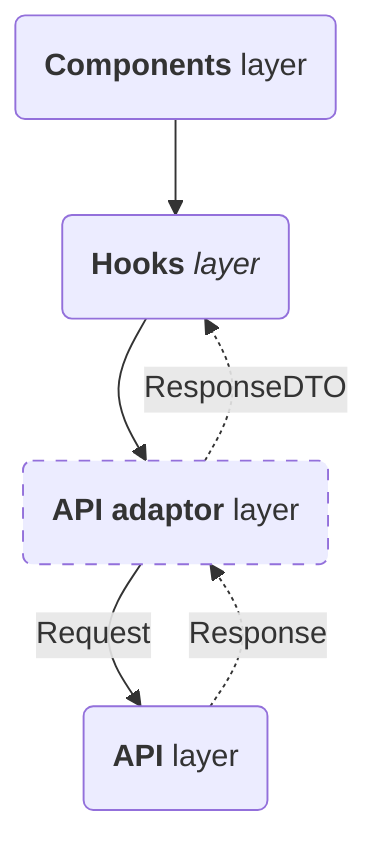
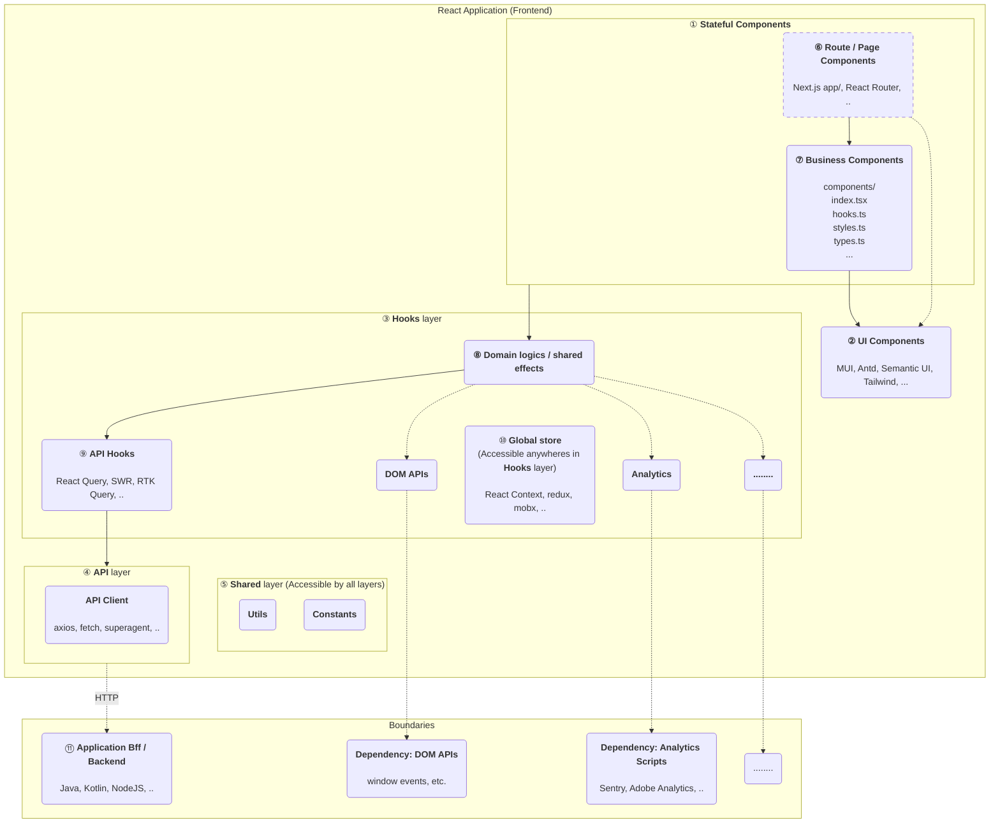
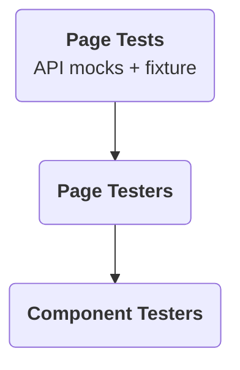

有效的自动化测试是任何企业级项目的必选项和质量根基。而实践已经证明，在前端仅做组件式的单元测试不够有效。本文将介绍一种更为有效的单元测试方式，让测试能够更好地支撑重构和开发。这套经验曾支撑笔者经历的一个年交易流水十亿美元级、历时五年+的金融系统的成功运营和维护演进。

## 太长不读——本文中心观点

正如我在5年前的[React单元测试策略及落地][react-unit-testing-best-practices]中所说，自动化测试，而且是**有效的自动化测试**，**对于任何一个企业级项目来说都是必选项而不是可选项**。这是由企业项目的两个特点决定的：**人员流动不可避免**、**应用演进不可避免**。这两点不因人的主观意志为转移。应用演进，意味着新的、遗留的业务和代码会越来越多；人员流动，意味着物理上不可能会有一个人能长期、完全地掌握单个应用的所有上下文。因此，希望通过手工测试（开发者自测或者单独的QA团队手测）的方式来保障质量，首先既是低效的，长期来看也是不可能的。

那么，有了自动化测试就可以了吗？答案也不是。我见过许多无效的自动化测试，最痛的莫过于花费许多精力写了测试，却发现测试无法支撑重构，许多简单的重构比如React组件重命名、搬移数据到Context都会挂许多测试，直接对开发效能起负作用。其次，测试缺乏有表达力、有意义的断言，或者测试的描述与断言与真实业务场景脱节（测试断言的是页面上有没有“￥400”，关联的业务场景却是报价能否成功）等等，也都是常见的无效测试模式。这样的无效测试，都不能帮助你留存业务知识、支撑随时随地进行的技术重构，也无法真正助力软件质量和研发效能的提升，久而久之只会让测试变成一场表演，变成不得不应付而又弃之可惜的鸡肋。

你需要的是真正**有效的自动化测试**。

如果你是企业的中层技术管理者（Tech Lead或者Technical Principle等），那么这是你应该关注的问题；如果你是正在努力成为技术骨干的开发者，这篇文章也正是为你准备的。

接下来，我会介绍什么是有效的自动化测试，然后以一个React应用为背景，介绍一个常见且有效的测试策略是什么、作为关键部分的单元测试应该怎么架构、怎么编写，我会给出十分充足的代码样例帮助你和你的团队去落地。最后，我还会介绍这部分关键的单元测试方式有什么挑战，帮助你对这项技术知己知彼。

这套经验是我在过去三年、两个项目上的实践和总结。它成功地帮助我们能够在一个支撑行内年十亿美元级交易数额的应用上，历时5年+、还没上TS的情况下仍能自信地修改和重构代码；它也成功地帮助了我们当前的项目从0到1搭建起有效的测试策略，如今一个具有复杂逻辑的页面已经有4000行测试代码的有效覆盖。这篇文章是实践中诞生的经验和总结。

舞台已经搭好，下面让我们直奔主题~~直接开演~~。

> 更新版更简单的：
> * 为什么写这个？因为企业级项目的成败在于有效的测试。
> * 测试从哪里来？软件架构。
> * React软件架构哪里来？邱大师
> 
> 🚧正文内容正在施工中。

## 目录

* 有效的自动化测试 v.s 无效的自动化测试 (Automated Tests Best Practice v.s Anti Practice)
* React应用架构与测试策略 (React Architecture & Testing Strategies)
* 测试架构、代码落地 (Test Architecture & Implementation)
* 新的衍生问题 (Arising Problems)
* 总结：优势 & 挑战 (Summary: Advantages & Challenges)
* Q & A

> 🚧正文内容正在施工中。

## 有效的自动化测试 v.s 无效的自动化测试 Automated Tests Best Practice v.s Anti Practice

前面讲了<WIP>。那么，什么是有效的自动化测试呢？无非两点：**支撑重构**、**表达力强**。支撑重构，持续改进才不是一句空话；表达力强，才能有效地在测试里留存业务上下文，方便每一个现在、将来需要维护代码库的成员。通常来说，能够支撑重构的测试，表达力强也是其不可或缺的一部分，因此我认为**能够支撑重构的测试，就是有效的自动化测试**。这个重要性怎么强调都不为过，是实施自动化测试关键中的关键。

更具体的例子，因为篇幅可能过长，我打算放在另一篇[什么是好的自动化测试][what-makes-a-good-automation-test]里写。请将其作为本篇的补充读物，里面的一些观点跟接下来要阐述的React单元测试实践是互相交织、一脉相承的。

## React应用架构与测试策略

> 🚧 今天组里讨论，结论就是有了React Hooks加成之后，每个React组件自己都是一个View + View Model。React Hooks作为组装数据和逻辑的手段而存在，通常是多个hooks服务一个View Model（如果你要说有这个东西）的构建，而Hooks本身并没有一个规范的接口——即输入输出——想输入啥、返回啥都可以，因而缺乏设计的Hooks本身并不能被称为一个“层”。

[软件架构是测试策略的前提要件][clear-architecture-is-a-prior-input-for-testing-strategy]。没有清晰的软件架构和分层定义，就难以制定有效的测试策略并加以实施。因此，在谈论React应用的测试策略之前，有必要定义一个常见的React应用架构作为参考。

[分层是应用架构的常见手段][why-layering-is-important-method-of-architecting]。分层的目的在于隔离变化传播，为上层调用提供透明且简便的功能接入和封装。在React 16引入React Hooks之后，一个常见但不严谨的分层架构往往是这样的：



在这个架构里，组件层是确定的，它负责处理的是把从下层得到的数据渲染成View，隔离的是渲染目标HTML的变化（借助JSX和React的V-DOM技术）。同时，API层也是确定的，它负责处理与三方系统交互的API调用，隔离的是通信协议（HTTP、GraphQL等）的变化。

API适配层的作用是，将API层得到的`Response`转换成前端应用可以使用的`ResponseDTO`结构，隔离的是后端数据结构变化对前端（Hooks、View等）的传播。这个隔离非常重要，但是这一层不一定是必须的：如果这一层非常薄、没有任何逻辑，那么直接让API层转换一层、返回`ResponseDTO`同样可达到隔离后端数据结构变化的目的；如果你使用了类似React Query之类的工具，那么这一层可以合并到Hooks的大“分层”里头。

Hooks严格来说不是一个“层”。一个架构意义上的分层，必须有明确的职责、明确的输入接口与输出接口。这些限制React Hooks本身是不提供的，有赖于开发者去定义它。关于什么是React Hooks的最佳实践和架构，我会放在这篇文章[React Hooks最佳实践与架构][react-hooks-best-practices]中去讨论。这里，我直接把一个我推荐的结果拿过来用，再细化一下，这样我们就得到了一个分层合适的React应用架构：



> 🚧架构图润色一下，Mermaid写着爽，看着丑。这里可以参考MF写文章以及邱大师那篇文章画架构图的经验：
> * 用颜色区分层
> * 用颜色区分不同组件，这样可以把整个App架构中的各类组件用颜色画出来
> * Mermaid还支持font-awesome的icon，也可以一起搞搞

可以看到，与[上一版的React架构相比][react-unit-testing-best-practices]相比，原来的全局状态管理（redux action/reducer那一套）以及副作用管理（redux-thunk、saga那一套），已经基本被新的React Hooks所取代。除此之外，新的架构里有这样一些变化：

* 不要求在业务组件中再细拆“容器组件”与“展示型组件”，统一归为①中的“有状态组件”；
* 由于本文采用的例子应用了React Query，它本身是个hooks的形式，因此上面的“API适配层”在此图中体现为⑨的API Hooks组件，归并在③的“Hooks层”中，返回一个包装后的`ResponseDTO`（未在上图中体现出~~因为mermaid画图的限制…~~）。DTO中可能承载一些领域、对象逻辑。

整个应用间的测试策略、乃至于整个架构（进程间）的测试策略（上图中与Boundaries交互的部分），我放到这篇文章[React系列（三）：测试策略与落地][react-testing-strategy-best-practice]来阐述。本篇的后续部分，我们来谈谈UI组件这部分单元测试的最佳实践——这也是本篇的重点。

### React UI组件测试最佳实践

> 在React和前端这个上下文中，单元测试不是最优解——这也是我上一版测试策略推荐对组件的测试方式——集成式的单元测试才是。它有一些缺点：🚧（什么缺点）。🚧（讲一下那什么才是最优解）。

在[上一版的React单元测试及策略中][react-unit-testing-best-practices]，对于React组件（上图中的⑦业务组件中）的测试，文章建议的是：拆分出展示型组件并对其进行简单的分支渲染测试、对于容器型（有状态）组件不做测试（因为过于麻烦）。这个思路实践下来，其实遇到不少问题和痛点：

* **不太支撑更大范围的重构**。比如在进行提炼组件（Extract Component）、提炼Hooks（Extract Hooks）等常见的重构时，组件往往由于接口（props）变化而使得单元测试失败，哪怕实际业务功能并未变化；
* **实际保护作用有限**。不测试有状态组件，导致接缝处没有测试，测试信心不足；
* **对于遗留项目补测试不友好**。遗留项目往往意味着组件设计也不良好，会有很多的props和依赖，对单一的组件做单元测试难以入手、需要很多精力去mock不必要的内部依赖。

我们在实践中发现，以上问题是确实存在的。为了解决这些痛点，在这版新的测试策略中，我们的新建议是：**不要对组件层中的单一组件做单元测试。应该从一个相对顶层的业务组件入手（可以是⑥的路由/页面组件），仅mock掉与HTTP/API部分的交互（④或⑪）而不mock内部实现（如③的Hooks层或⑦业务组件中的逻辑）。也即对组件的测试，从⑥或是⑦开始，然后基本覆盖整个应用进程内所有的层级和组件（x色框内的部分）**。使用RTL（React testing library）基于JSDom的测试，我们可以把这种测试的运行速度仍然限制在单元测试的范畴中。

> 讲一下黑马里关于发现问题的测试和定位问题的测试。
> 
> 但我无意发明新的名词，因此，本文所需的只是一个用来指代本文这样一种测试方式的指称。

## 测试架构、代码落地

> 🚧施工中。这里可以参考MF写文章以及邱大师那篇文章，用一个over simplified的例子来“驱动”出整个测试策略的推理过程。

> 🚧看看这部分怎么展开来讲会好一些。
> * 测试代码架构：API DSL（方便的API mock语法）+Fixture（mock数据）+tester（选择器）+expectations（测试断言）
> * API mock & DSL
> * 组件层tester沉淀和API设计
> * 测试主体 
>   * UI内容断言 
>   * 用户行为交互 
>   * API Mock

>
> 🚧这个图可以扩展一下，讲讲多个页面/业务组件的时候会怎么演变。



Tester例子：

```typescript
interface DropdownTester {
  getLabel(): string;
  getValue(): string;
  getDisplayText(): string;
  getOptions(): string[];
}

export const findDropdown = (testId: string): DropdownTester => {
  const getElement = () => screen.getByTestId(testId)
  const getLabel = () => screen.getByTestId(`${testId}-dropdown-label`).textContent 
  const getValue = () => screen.getByTestId(`${testId}-dropdown-input`).getAttribute('value') 
  const getDisplayText = () => { return /* ... */ }
  const getOptions = () => { return /* ... */ }

  return { getLabel, getValue, getDisplayText, getOptions }
}
```

Page tester很简单，就是对tester的直接封装：

```typescript
export const getProductCategoryDropdown = (): DropdownTester => {
  return findDropdown('product-category')
}

export const getProductSubCategoryDropdown = (): DropdownTester => {
  return findDropdown('product-sub-category')
}
```

API Mock DSL例子：

```typescript
export class ProductPageDSL {
  apiMock: ApiMocks

  constructor() {
    this.apiMock = new ApiMocks();
  }

  mockProductCategories = (categories: ProductCategory[]): this => {
    const fixture = buildProductCategoryResponse(categories) as ProductCategoriesResponse
    this.apiMock.onProductCategories(fixture)
    return this;
  }

  mockAvailableProducts = (products: Products[]): this => {
    return this;
  }
}

export class ApiMocks implements ApiClient {
  constructor() {
    this.apiClient = createWhateverApiClientYourProjectUses()
  }

  onProductCategories(response: ProductCategoriesResponse): ApiMocks {
    this.apiClient.onGet('/api/v1/product-categories').replyOnce(200, response);
    return this;
  }

  onAvailableProducts(response: ProductsResponse): ApiMocks {};
}
```

一个简单的测试例子：

```tsx
describe('product detail page', () => {
  const productPageDsl: ProductPageDSL = new ProductPageDSL()
  
  describe('page rendering', () => {
    beforeEach(() => {
      // given
      productPageDsl.mockProductCategories([
        {
          id: 'WWJD-23', category: ProductCategory.DIGITAL_PRODUCTS,
          subCategories: [ProductSubCategory.I_PHONE, ProductSubCategory.LAPTOP],
        },
        {
          id: 'WWJD-38', category: ProductCategory.CLOTHES,
          subCategories: [ProductSubCategory.CASUAL, ProductSubCategory.SPORTS],
        },
      ])
    })
    
    it('should render form with available product category options', () => {
      // when
      renderComponents(<ProductPage />) // ProductPage fetches data on its' own
      
      // then 
      expect(getProductCategoryDropdown().getLabel()).toBe('Product Category')
      expect(getProductCategoryDropdown().getOptions()).toEqual(['Digital Products', 'Clothes'])

      expect(getProductSubCategoryDropdown().getLabel()).toBe('Product Sub-Category')
      expect(getProductSubCategoryDropdown().getOptions()).toEqual([])
    });
    
    it('sub category dropdown should be disabled when category is not selected first', () => {
      renderComponents(<ProductPage />)
      
      expect(getProductCategoryDropdown().getValue()).toBe('')
      expect(getProductCategoryDropdown().isEnabled()).toBeTruthy()
      expect(getProductSubCategoryDropdown().isEnabled()).toBeFalsy()
    });
  });
})
```

## 衍生问题

> 🚧施工中。

* 以什么为“页面”/单位？路由或页面组件（Page component）
* 跨“页面”的功能（比如用户改变了路由、跳到了另一个页面的一些功能等），用不用这套东西测？
* 测试文件过长：抽函数、放弃不必要的断言
* 测试文件如何组织：
  * 以功能组织，写的时候可能跨好几个`describe`/文件，难以发现、难以维护；
  * 以页面组织，容易很分散，看不出业务逻辑。
* 如何debug？

## 总结：优势 & 挑战

> 🚧施工中。

有什么好处？

* 支持重构：改功能时测试能有效保障行为、不需要改动相应的测试；
* 越写越顺手，组合式，写新测试相当容易；
* 测试断言声明式，有效留存业务上下文。

挑战是什么：一个有效的测试策略，以及编写测试的能力，来管理这些开发成本、维护成本。

* 有一定的开发成本——相比纯函数而言。
* 有一定的维护成本——需要保证测试间独立性（因为引入了API mock而不是组件级别的mock）、等
* 定位问题的能力相对“绝对的单元测试”有所降低。

## Q & A

> 🚧Q & A也正在施工中。欢迎跟作者先期提出你的实践困惑：[linesh.simpcity@gmail.com](mailto:linesh.simpcity@gmail.com)。

> 问题：这篇文章跟上一版的[《React单元测试策略及落地》][react-unit-testing-best-practices]相比有何变化？

如果你是上一篇[《React单元测试策略及落地》][react-unit-testing-best-practices]的读者，那么这里我为你快速总结了一下本篇相比于前篇的扬弃之处，以便你更快地理解本篇的架构和内容，并继续吸收上一篇中的精华部分。简要说来，在上一版中：

“为什么要做（单元）测试”部分没有变化。有效的自动化测试仍然是**根本的质量保障**，这是因为人员流动和应用演进这两个因素对于企业级项目来说并没有改变。

“什么是好的（单元）测试”这部分，上一篇提到的“不包含逻辑”、“运行速度快”这两点在本篇即将介绍的测试策略下需要*相对妥协*，目的是为了更好地支撑这个更本质的要求：支撑重构。

“（单元）测试策略”这部分，给出了一个基于新React能力的架构，以及与之对应的新的测试策略。**这个新策略，一方面是让测试更好地支撑重构，一方面也能在遗留系统/之前没有这类测试的项目更好地渐进式导入，比较适合历史包袱较重的项目。**
* 负责全局状态管理的action/reducer有了更轻量级的React Hooks和React Context因而不再是必选项了；
* 负责派生数据计算的selector一部分可以挪到hooks里头，一部分可以合并到UI组件内部使用`useMemo`等，这层也没有了；
* 负责副作用管理/编排的saga/thunk这块，其主要部分的API管理及其他部分都可以合并到hooks里头，这层也可以没有了；
* 组件层，**原来的策略是只测逻辑，新策略中建议是拉通hooks一起测，并且要测试页面内容**。这是本篇最大的变化（和精华）。

“（单元）测试落地”这部分，本篇给出了大量基于新的单元测试策略的代码。

> 问题：为什么采用集成式测试组件的策略？MVVM分离为什么不行？

* 不实际。有了Hooks以后，现代React组件其实就是个组合所有逻辑的地方，所有协调都在这里。
* 有额外成本。抽专门的VM之后，意味着抽组件等常见重构很可能就会挂掉VM，这阻碍了做有效测试策略的初心；其次，VM和View单独（但愿）测试，并不能说明VM上的东西被正确地放到了View上，这里的集成点测试是遗失的。如果说过去五年我在前端测试上有什么收获和经验，那就是在组件层拆定义很细的层并做单元测试不符合前端View频繁改变的现状，会带来许多不必要的测试、削弱测试有效性。

> 问题：为什么“组合逻辑”这部分不是放到Bff、而是让前端来自己处理这部分转换？

## 参考

* [Modularizing React Applications with Established UI Patterns][]
* [Vue应用单元测试策略与实践][jimmy-vue-unit-testing-best-practice]

## 参考中

* Modularizing React Applications with Established UI Patterns
  * MF说的view-model-data三层架构中，model和data有啥区别？model和view model有啥区别？
  * UI层要做得薄一些，这样万一React要换，也只需要换掉React这个uI框架，领域逻辑都不用动
    * 那么Hooks怎么写才能不依赖于React？
    * 这个UI层框到哪里？整体架构是什么？
  * 我这篇文章的建议是，测试应该包到business component + hooks，甚至+fetcher层，mock的是API。那么自然有问题：我mock fetcher为什么不行？为什么要把这个层的包进来？因为我用了React Query，它里头有获取state、操作UI（比如notification）、`onSuccess`的部分，业务逻辑就写在里头，不包进来没地方测。
* [testing pyramid](https://testingjavascript.com/)
* [An example of LLM prompting for programming](https://martinfowler.com/articles/2023-chatgpt-xu-hao.html)
* [React Testing Guide](https://components.guide/react+typescript/testing)
* [Kent's blog](https://kentcdodds.com)
* what's a typical/recommended React application structure?

[^automated-tests-for-enterprise-only]: 对于个人项目，自动化测试乃至TDD实践是否必须只跟维护有关，你自己开心就行。

[react-unit-testing-best-practices]: https://ethan.thoughtworkers.me/#/post/2018-07-13-react-unit-testing-strategy
[react-hooks-best-practices]: https://ethan.thoughtworkers.me/#/post/2023-12-09-react-hooks-best-practices
[what-makes-a-good-automation-test]: https://ethan.thoughtworkers.me/#/post/2023-12-24-what-makes-a-good-automation-test
[react-testing-strategy-best-practice]: https://ethan.thoughtworkers.me/#/post/2023-12-25-react-testing-strategy-and-best-practices

[jimmy-vue-unit-testing-best-practice]: https://blog.jimmylv.info/2018-09-19-vue-application-unit-test-strategy-and-practice-01-introduction
[Modularizing React Applications with Established UI Patterns]: https://martinfowler.com/articles/modularizing-react-apps.html

[clear-architecture-is-a-prior-input-for-testing-strategy]: https://zhuanlan.zhihu.com/p/560276012
[why-layering-is-important-method-of-architecting]: https://w.i.p.com
