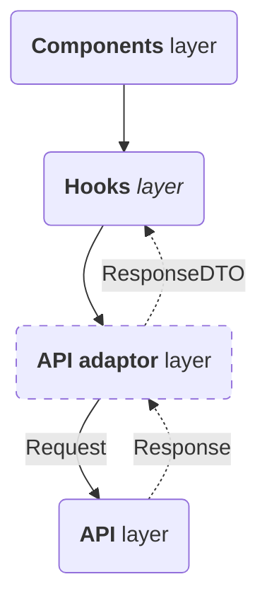
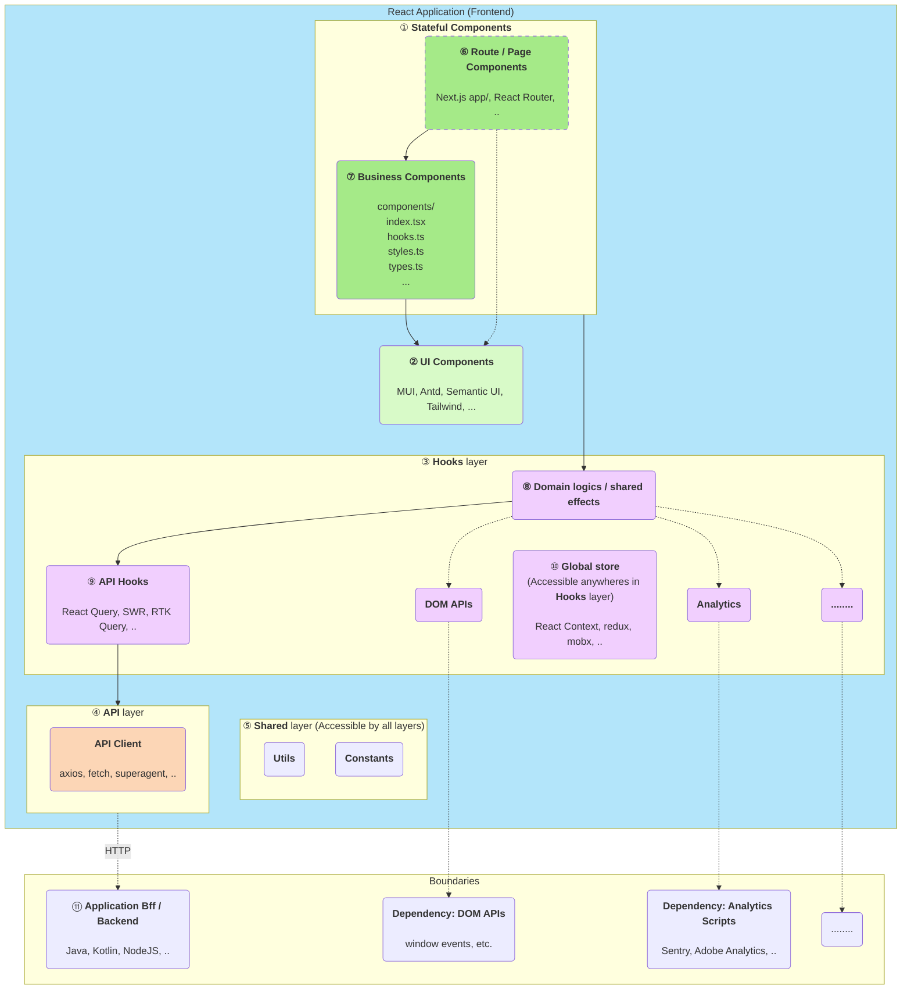
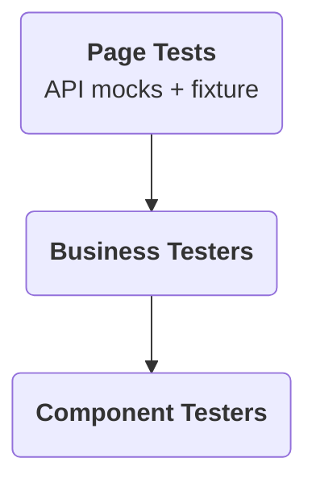
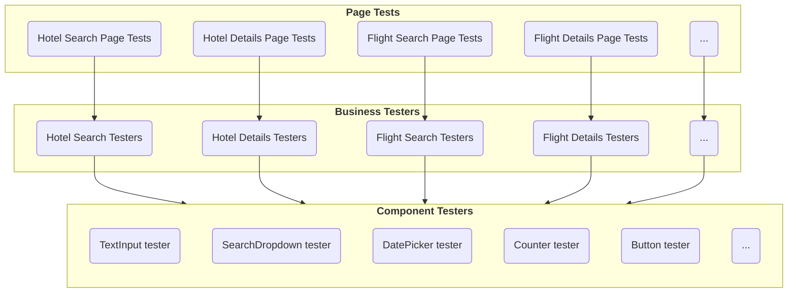

实践证明，在前端以细粒度的UI组件为单元做测试不能很好地支撑重构和需求变化。本文将介绍一种更能支撑前端TDD、能更好地支撑重构和开发的单元测试方案。

这套经验曾支撑笔者经历的一个年交易流水十亿美元级、历时五年+的金融系统的成功运营和维护演进。

## 太长不读——本文中心观点及大纲

* 有效的自动化测试是企业级应用的必选项。过度依赖手工测试会拖慢系统演进速度、增加组织成本。
* 在前端（React）领域，你所做的自动化测试不一定是有效的。
* 有效的自动化测试就是能够有效支撑重构的测试。
* 测试策略来源于软件架构。本文介绍了一种常见且有效的React应用架构。
* 有效的测试策略，只应该mock API，而不应该mock组件常见内部实现，如React hooks、Redux、React组件等。
* 测试本身也有分层。本文介绍了一种推荐的分层实践：API DSL、business tester、component tester。
* 为了实现有效支撑重构这个根本目标，测试引入的分层会带来一些额外的（一次性及短期）成本。
* 承担这个成本是值得的。一切都是为了让你的测试能够真正支撑重构、有效留存业务上下文，真正助力研发效能。

## 目录

* 为什么有效的自动化测试很重要 (Why Effective Automated Tests Are So Important)
* 有效的自动化测试 v.s 无效的自动化测试 (Automated Tests Best Practice v.s Anti Practice)
* React应用典型架构 (A Typical React App Architecture)
* React组件单元测试最佳实践 (Best Practice Unit Testing React Components)
* 测试架构与代码落地
  * 场景（一）：静态页面测试
  * 场景（二）：用户交互
  * 场景（三）：Mock API返回
* 总结：好处与挑战 (Summary: Advantages & Challenges)
* Q & A
* 参考

> 🚧正文内容正在施工中。

## 为什么有效的自动化测试很重要

正如我在5年前的[React单元测试策略及落地][react-unit-testing-best-practices]中所说，自动化测试，而且是**有效的自动化测试**，**对于任何一个企业级项目来说都是必选项而不是可选项**。这是由企业项目的两个特点决定的：**人员流动不可避免**、**应用演进不可避免**。这两点不因人的主观意志为转移。应用演进，意味着新的、遗留的业务和代码会越来越多；人员流动，意味着物理上不可能会有一个人能长期、完全地掌握单个应用的所有上下文。因此，希望通过手工测试（开发者自测或者单独的QA团队手测）的方式来保障质量，首先既是低效的，长期来看也是不可能的。

那么，有了自动化测试就可以了吗？答案也不是。我见过许多无效的自动化测试，最痛的莫过于花费许多精力写了测试，却发现测试无法支撑重构：许多简单的重构——比如React组件重命名、将数据从State搬移到Context等——都会导致许多测试失败，直接对开发效能起负作用。其次，测试缺乏有表达力、有意义的断言，或者测试的描述与断言与真实业务场景脱节——比如测试断言的是页面上有没有“￥400”，关联的业务场景却是报价能否成功——等等，也都是常见的无效测试模式。这样的无效测试，都不能帮助你留存业务知识、支撑随时随地进行的技术重构，也无法真正助力软件质量和研发效能的提升，久而久之只会让测试变成一场表演，变成不得不应付而又弃之可惜的鸡肋。

你需要的是真正**有效的自动化测试**。

如果你是企业的中层技术管理者（Tech Lead或者Technical Principle等），那么这是你应该关注的问题；如果你是正在努力成为技术骨干的开发者，这篇文章也正是为你准备的。

接下来，我会介绍什么是有效的自动化测试，然后以一个React应用为背景，介绍一个常见且有效的测试策略是什么、作为关键部分的单元测试应该怎么架构、怎么编写，我会给出十分充足的代码样例帮助你和你的团队去落地。最后，我还会介绍这部分关键的单元测试方式有什么挑战，帮助你对这项技术知己知彼。

这套经验是我在过去三年、两个项目上的实践和总结。它成功地帮助我们能够在一个支撑行内年十亿美元级交易数额的应用上，历时5年+、还没上TS的情况下仍能自信地修改和重构代码；它也成功地帮助了我们当前的项目从0到1搭建起有效的测试策略，如今一个具有复杂逻辑的页面已经有4000行测试代码的有效覆盖。这篇文章是实践中诞生的经验和总结。

## 有效的自动化测试 v.s 无效的自动化测试

正如上节所讲，写了自动化测试不意味着团队有效应对业务演进和技术重构的效能提升了。只有**有效的**自动化测试才能真正让测试成为团队和开发者的助力。

那么，什么是有效的自动化测试呢？无非两点：**支撑重构**、**表达力强**。支撑重构，持续改进才不是一句空话；表达力强，才能有效地在测试里留存业务上下文，方便每一个现在、将来需要维护代码库的成员。通常来说，能够支撑重构的测试，表达力强也是其不可或缺的一部分，因此我认为**能够支撑重构的测试，就是有效的自动化测试**。这个重要性怎么强调都不为过，是实施自动化测试关键中的关键。

更具体的例子，因为篇幅可能过长，我打算放在另一篇[什么是好的自动化测试][what-makes-a-good-automation-test]里写。请将其作为本篇的补充读物，里面的一些观点跟接下来要阐述的React单元测试实践是互相交织、一脉相承的。在这里，我打算给出一个典型的、集“大成”于一体的无效自动化测试，读者不妨看看，它都有哪些“无效”的地方、你的项目又是否正在经历这些无效测试的折磨。

> 🚧这部分草稿在另一台电脑上。

```tsx
WIP
```

简而言之，无效的自动化测试可能包含以上的一个或多个特征：

* WIP

## React应用典型架构

[软件架构是测试策略的前提要件][clear-architecture-is-a-prior-input-for-testing-strategy]。没有清晰的软件架构和分层定义，就难以制定有效的测试策略并加以实施。因此，在谈论React应用的测试策略之前，有必要定义一个常见的React应用架构作为参考。

[分层是应用架构的常见手段][why-layering-is-important-method-of-architecting]。分层的目的在于隔离变化传播，为上层调用提供透明且简便的功能接入和封装。在React 16引入React Hooks之后，一个常见但不严谨的分层架构往往是这样的：



在这个架构里，组件层（Component Layer）是确定的，它负责处理的是把从下层得到的数据渲染成View，隔离的是渲染目标HTML的变化（借助JSX和React的V-DOM技术）。同时，API层也是确定的，它负责处理与三方系统交互的API调用，隔离的是通信协议（HTTP、GraphQL等）的变化。

API适配层的作用是，将API层得到的`Response`转换成前端应用可以使用的`ResponseDTO`结构，隔离的是后端数据结构变化对前端（Hooks、View等）的传播。这个隔离非常重要，但是这一层不一定是必须的：如果这一层非常薄、没有任何逻辑，那么直接让API层转换一层、返回`ResponseDTO`同样可达到隔离后端数据结构变化的目的；如果你使用了类似React Query之类的工具，那么这一层可以合并到Hooks的大“分层”里头。

Hooks严格来说不是一个“层”。一个架构意义上的分层，必须有明确的职责、明确的输入接口与输出接口。这些限制React Hooks本身是不提供的，有赖于开发者去定义它。关于什么是React Hooks的最佳实践和架构，我会放在这篇文章[React Hooks最佳实践与架构][react-hooks-best-practices]中去讨论。这里，我直接把一个我推荐的结果拿过来用，再细化一下，这样我们就得到了一个分层合适的React应用架构：



与一些[更早版本的React架构][react-unit-testing-best-practices]相比，React 16之后的Hooks基本上接管了所有副作用以及逻辑处理的代码，包括原来的状态管理（[Redux action/reducer][redux]那一套）、副作用（[redux-thunk][]、[redux-saga][]等）等。除此之外，上面这版架构里有一些变化值得强调：

* 不强求对业务组件⑦中再细拆“容器组件”与“展示型组件”¹。除了UI组件②之外的React组件（⑦以及可能有的⑥），统一归为①中的“有状态组件”。
* UI组件②这里特指通用型的UI组件，如[MUI][]、[Ant Design][antd]等或者项目自己封装的UI组件库，而不包含有业务含义的“展示型组件”（指不调用React Hooks、纯纯接受props并渲染UI的组件）。
* 由于本文采用的例子应用了React Query，它本身是个hooks的形式，因此上面的“API适配层”在此图中体现为⑨的API Hooks组件，归并在③的“Hooks层”中，返回一个包装后的`ResponseDTO`（未在上图中体现出~~因为mermaid画图的限制~~）。DTO中可能承载一些领域、对象逻辑。

整个应用间的测试策略、乃至于整个架构（进程间）的测试策略（上图中与Boundaries交互的部分），我放到这篇文章[React系列（三）：测试策略与落地][react-testing-strategy-best-practice]来阐述。本篇的后续部分，我们重点来谈谈“如何测试UI组件”这部分的最佳实践。

## React组件单元测试最佳实践

[有些观点（没错就是我上一版推荐的React测试策略）][react-unit-testing-best-practices]认为对于React组件（也就是上图中的⑦业务组件和②UI组件）的测试，应该是尽可能拆分出有状态组件（容器组件）和无状态组件（展示型组件），保持接缝简单，然后分而治之：对于无状态组件可以测测它的分支渲染逻辑、甚至断言一些DOM文本等；对于有状态组件则建议不做测试，因为较为麻烦。

这个思路不能说是毫无道理，但是实践下来会遇到一些问题和痛点：

* **不太支撑更大范围的重构**。比如在进行提炼组件（Extract Component）、提炼Hooks（Extract Hooks）等常见的重构时，组件往往由于接口（props）变化而使得单元测试失败，哪怕实际业务功能并未变化。
* **实际保护作用有限**。实践中的接缝很难如设想的“尽量保持简单”，很多逻辑会溜进去——尤其是React Hooks面世之后——不测试这部分逻辑常常导致测试带来的信心不足、不敢重构。
* **对于遗留项目补测试不友好**。遗留项目往往意味着组件设计也不良好，会有很多的props和依赖，对单一的组件做单元测试难以入手、需要很多精力去mock不必要的内部依赖。

为了解决这些痛点，在这版新的测试策略中，我们的新建议是：**不要隔离Hooks层（③）对组件层（⑦或②）中的单一组件做单元测试。应该从一个相对顶层的业务组件入手（建议是⑥的路由/页面组件，如有），仅mock掉与HTTP/API交互的部分（④或⑪），将其他内部实现（③的Hooks层、⑤的共享层等）纳入测试范围**。这意味着，涉及领域逻辑的Hooks（③/⑧）、全局数据管理的Hooks⑩，甚至业务组件⑦中的逻辑都会被视为内部实现，不对其进行mock处理。

**也即是说，对组件的单元测试，从顶层的业务组件⑥或⑦开始，然后覆盖整个应用进程内所有的层级和组件——也即是上图蓝色框中的部分²**。

## 测试架构、代码落地

接下来我们将用一个简化的例子来展示组件的单元测试怎么来写。假设以下是我们拿到的一个新的故事卡（Story，敏捷中常用的需求管理方式），它有如下的AC（验收条件，即要做的需求）需要开发。

> LOTEL-1
> 
> **作为**用户，**我希望**能搜索城市所在地的酒店信息，**以便**我有效地根据旅游行程安排我的住宿。
>
> **In Scope（需要做的需求）**
> * 搜索主页：支持通过热门城市搜索酒店
> * 显示酒店搜索列表及信息
> 
> **Out of Scope（不需要做的需求）**
> * 酒店详情页 - 故事卡LOTEL-2会做
> * 酒店预订下单 - 故事卡LOTEL-3做
> * 根据热门景点/商圈快速搜索酒店 - 故事卡LOTEL-4做
> * 高级筛选 - MVP之后做
> 
> **Acceptance Criteria（验收标准）**
> 
> AC1. **当**用户访问系统主页时，**应该**能看到一个搜索框，支持按照目的地城市、入住时间段和入住人数搜索可入住酒店
> * **当**用户点击目的地城市时，**应该**能看到目前仅支持的可选城市为：北京、上海、广州、深圳、成都、重庆、杭州、武汉。
> * **当**用户首次访问主页时，**应该**能看到各字段的默认值（以便他们能快速进入AC3的搜索流程）：目的地城市：北京。入住时间段：当天-明天。入住人数：1。
>
> AC2. **当**用访问系统主页时，**应该**能修改入住信息
> * **当**用户修改入住时间时，**应该**能看到系统帮用户自动提示入住天数。例子：2024-01-01 - 2024-01-03将显示“2晚”
>
> AC3. **基于**AC1或AC2，**当**用户点击“搜索”按钮时，**应该**能在查询成功后看到符合条件的可选酒店列表。
> * 酒店列表应该包含如下信息：当日最低价、点评数、用户评分、图片、星级。
> * 点评数小于100时统一显示“≤100条评论”。

> 🚧补一个UI动图

让我们一个一个AC来看看它们对应的实现以及最主要的测试代码。

### 场景（一）：静态页面测试

AC1是最简单的，无非一个静态的表单。考虑到“目的地城市”信息在未来大概会扩展并从后端获取（以及本文展开需要😂），我们把它放到一个hooks中，将来接入API时可以只替换hook这部分的逻辑。最后的成品代码应该大致如下所示：

> 🚧贴一下实现代码

按照我们在“React UI组件测试最佳实践”一节中介绍的测试策略，我们的测试从作为路由入口的`SearchPage`开始。整个成品测试最后会长这个样子：

```tsx
describe('search hotels', () => {
  const searchPageDSL : SearchPageDSL = new SearchPageDSL()

  describe('search entry - home page', () => {
    beforeEach(() => {
      // given ①
      searchPageDSL.mockRecommendationCities([
        { id: 'BJ', name: '北京', }, { id: 'SH', name: '上海', },
        { id: 'GZ', name: '广州', }, { id: 'SZ', name: '深圳', },
        { id: 'CD', name: '成都', }, { id: 'CQ', name: '重庆', },
        { id: 'HZ', name: '杭州', }, { id: 'WH', name: '武汉', },
      ])
    })

    afterEach(() => {
      searchPageDSL.reset()
    })

    it('should render a search box that supports searching available hotels by destination, check-in period and number of occupancy', () => {
      // when ②
      render(<SearchPage />) // SearchPage fetches data on its' own
      const destinationField: SearchDropdownTester = getDestinationField()

      // then ③
      expect(destinationField.getLabel()).toBe('目的地/酒店名称')
      expect(destinationField.getOptions()).toEqual([
        '北京', '上海', '广州', '深圳', '成都', '重庆', '杭州', '武汉'
      ])

      expect(getCheckinDateField().getLabel()).toBe('入住时间')
      expect(getCheckoutDateField().getLabel()).toBe('退房时间')

      expect(getOccupancyField().getLabel()).toBe('住客人数')
      
      expect(getSearchButton().isPresent()).toBeTruthy()
    });
  });
})
```

怎么样，第一感有没有觉得这个测试相当可读、基本就是需求（AC1）和UI的代码化表达？这是我想表达的好测试的重要一点：**表达力强**。这个强表达力，一方面在于充分利用好describe/it描述等文本工具，一方面也在于我们精心分层并封装的business tester / component tester极富表达力，使我们得以尽量按照需求和UI的描述方式来进行断言。

下面让我们展开business tester和component tester这部分的代码细节，来看看在上面这个测试中被封装的部分。**Business tester**很简单（也就是when②的部分），其实就是对component tester的简单封装。

```ts
import TestIds from '@src/constants/testIds'

export const getDestinationField = (): SearchDropdownTester => {
  return findSearchDropdown(TestIds.search.destination)
}

export const getCheckinDateField = (): DatePickerTester => {
  return findDatePicker(TestIds.search.checkinDate)
}

export const getCheckoutDateField = (): DatePickerTester => {
  return findDatePicker(TestIds.search.checkoutDate)
}

export const getOccupancyField = (): CounterTester => {
  return findCounter(TestIds.search.occupancy)
}
```

这一层的主要作用是为上层测试提供一个业务视角的API，并屏蔽test id、tester等细节，提升上层测试的抽象层次以及可读性。同时，这一层的存在也使得编写上层测试变得更加轻松了：你只需要将待测试的业务点“翻译”成英文，然后一路通过TypeScript的类型提示自动输入到底就行，极大提升了开发者体验。

<贴一张开发者体验的动图。>

**Component Tester**（也就是then③的部分），顾名思义封装的就是一个UI组件（component）。注意我们这里说的UI组件是指通用组件库或设计系统（比如MUI、AntD等）的UI组件，而不是业务上的“纯UI”组件，因为通用的UI组件库才可能提供足够通用的`Tester`接口。下面以上面business tester中用到的`SearchDropdownTester`为例子来看看这层的代码。

```ts
import screen from '@testing-library/react'
import userEvent from '@testing-library/user-event'
import { findFirstChildren } from './reusable-testing-utils'

interface SearchDropdownTester {
  getLabel(): string;
  getValue(): string;
  getDisplayText(): string;
  getOptions(): string[];

  isPresent(): boolean;
  isEnabled(): boolean;
}

export const findSearchDropdown = (testId: string): SearchDropdownTester => {
  // implementation details
  const getElement = () => screen.getByTestId(testId)
  const getDropdownWrapperElement = () => findFirstChildren(getElement(), 'div')
  const clickDropdown = async () => {
    await userEvent.click(getDropdownWrapperElement())
  }

  // public interfaces
  const getLabel = () => screen.getByTestId(`${testId}-dropdown-label`).textContent
  const getValue = () => screen.getByTestId(`${testId}-dropdown-input`).getAttribute('value')
  const getDisplayText = () => { return /* ... */ }
  const getOptions = () => {
    await clickDropdown() // to open the dropdown so the options/dropdown would appear in DOM
    const options = screen.getAllByRole('option').map(option => option.textContext)
    await clickDropdown() // to close the dropdown and resume dropdown component to original state
    return options
  }

  const isPresent = () => { return /* ... */ }
  const isEnabled = () => screen.getByTestId(`${testId}-input`).getAttribute('disabled') === null
  
  return { getLabel, getValue, getDisplayText, getOptions, isPresent, isEnabled }
}
```

从上面的代码不难看出，这一层封装了许多操作UI的细节（比如上图的`getLabel()`/`getOption()`方法、以及我们是通过RTL这样的库来操作DOM等），然后对外暴露一个非常通用的接口以查询组件的状态（比如获取该搜索下拉框的label值、展示文本值、禁用/启用状态等），而非暴露许多实现细节（比如读者可能留意到了`getElement()`这样的方法并没有被作为Tester接口暴露出去），这也是设计原则中“接口优于实现”的体现。这样做可以让上层的调用变得非常简单、且无需关注过多的无关的细节（对比一下“无效的自动化测试”一节中的样例），进而让编写测试的心智负担大大降低，并大幅度地提升开发体验。

这一层主要有两个作用。第一是，它同样地为上层提供一个UI视角的API。比如，相比于直接在测试中操作React testing library去找到下拉框的wrapper并点击、选中所有role是option的元素并抽取文本……等等操作，上层测试得以用`.getOptions()`这样简单的API就可以拿到测试需要的数据，既大大提升了测试可读性，也使得这些行为很容易可以在测试之间被复用（再次对比一下“无效的自动化测试”一节中的样例）。第二是，这一层还天然地隔离了UI库和selector库的变化：如果未来应用更换了设计系统或UI组件库，那么只有这一层的tester需要更新，测试的其他层次并不会受到影响。同样地，如果未来的某一天出现了RTL更好的selector工具，那么相关的变化也只会被限制在这一层，大大提升了测试架构的稳定性和扩展性。真实的事迹，就发生在笔者过去的金融项目上：当时我们封装的这一层component tester是2019年之前，RTL尚未面世，项目上这一层是使用jQuery实现的。而在2023年的今天，这一层的存在就能让我们以更小的代价迁移到更好的RTL上。

至此，一个简单的组件测试雏形就出来了。麻雀虽小，但是五脏聚全，它遵循的是如下的分层架构：



正如我们所提到的，最终component tester可以被不同的上层所用。当应用扩展（业务/页面增加）时，这个架构大概率会像这样去演进：



#### 新增测试

同样，表单字段默认值的功能也很容易添加测试。我们在原来的测试上新增一个`it()`块即可——business tester和component tester都无需改动。通过把测试的粒度拆小，我们既能让测试描述更好地描述业务场景、留存业务上下文，也能让单个测试的重点突出、避免过长的测试，从而提高可读性和可维护性。这样当测试失败时，你就能马上知道被影响的业务场景是什么

*hotel-search.test.ts*
```tsx
describe('search hotels', () => {
  describe('search entry - home page', () => {
    ...
    
    it('should render a search box ...', () => { ... });
    
    it('searching fields should have default values so we give user an example, allowing them to navigate to the search result page asap', async () => {
      render(<SearchPage />)

      expect(getDestinationField().getDisplayText()).toBe('北京')
      expect(getCheckinDateField().getSelectedDate()).toBe('2024-01-01')
      expect(getCheckoutDateField().getSelectedDate()).toBe('2024-01-02')
      expect(getOccupancyField().getValue()).toBe(1)
    });
  });
})
```

### 场景（二）：用户交互

AC1只是一个简单的静态页面，并不困难，接下来我们来看一个更常用的场景：用户与UI交互并产生一些修改。也就是AC2中，用户编辑入住信息的场景。

在真实的业务场景中，我们往往需要存储一些中间状态——也就是这里的用户入住查询信息。在这个例子中，我们将暂时使用state来存储用户的修改。最终，我们的实现代码应该类似这样：

```tsx
WIP
```

测试代码也非常简单，基本就是抄抄抄：business tester已经有了，不用新增；component tester层，`SearchDropdownTester`的`select()`方法似乎还未实现，需要实现一下。除此之外，就是“翻译”一下AC，直接抄一个`it()`块稍微修改，得到最终的测试（你也可以让ChatGPT来帮忙）：

*SearchDropdownTester.ts*

```typescript
interface SearchDropdownTester {
  ...
  select(value: string): Promise<void>;
}

export const findSearchDropdown = (testId: string): SearchDropdownTester => {
  // implementation details
  ...
  const clickDropdown = async () => {
    await userEvent.click(getDropdownWrapperElement())
  }

  // public interfaces
  ...
  const select = async (value: string) => {
    await clickDropdown()
    await userEvent.click(screen.getByRole('option', { name: value }))
  }

  return { ..., select }
}
```

*hotel-search.test.ts*

```tsx
describe('search hotels', () => {
  describe('search entry - home page', () => {
    ...
    
    it('should render a search box ...', () => { ... });

    it('searching fields should have default values ...', () => { ... });
    
    it('user should be able to edit searching destination - I am indeed planning a travel to Hangzhou', async () => {
      render(<SearchPage />)
      await getDestinationField().select('杭州')
      
      expect(getDestinationField().getDisplayText()).toBe('杭州')
    });
  });
})
```

易如反掌！

在实际项目中，状态存储往往更加复杂、更加精密。组件内部的状态往往用state就可以解决，随着项目的发展，某些数据往往因为需要更广的可见性而需要搬移到[Context][react-context]、全局状态管理（如[Redux][redux]、[Mobx][mobx]等解决方案）上，某些数据也可能需要通过表单方案（如[React Hook Form][react-hook-form]等）来管理。重要的是，使用了什么数据方案对测试来说并不重要——读者可以看见React `useState`的实现并没有体现在以上的测试中——因为它仅仅是对应功能/业务的一种*实现手段*。实现手段是可以随时间变化的，而它的变化不应该成为测试失败的理由，或者至少其影响应该被局限在一个非常小的层内。

以上就是笔者在本文想提倡的，真正能够**支撑重构**的测试。读者可以尝试用其他的数据方案来实现、重构“用户编辑”的功能，看看测试是不是能很好地支撑重构，有效保护核心的功能点。

此外，读者应该也可以注意到，相比前两个测试，我们新增第三个测试的时候并不需要重新编写许多的代码。通常来说，business tester这层只要编写过一遍就可以一直复用，而component tester这一层随着项目的沉淀也应该越来越完善，越写越简单。

编辑入住时间与入住人数的测试因篇幅故不再赘述，读者可以尝试自己实现一下哦。

### 场景（三）：Mock API返回

接下来，让我们看看AC3的实现。这是个支撑用户进行搜索的功能，它需要依赖后端的API来完成结果渲染。API位于前端架构的边界点，对我们的测试策略也有影响。因此，处理好这部分的设施，也是使我们的测试策略更加通用的关键。

功能实现部分，我们使用`useHotelSearch()`来完成API发送（例子里这一层使用了[React Query][react-query]），它封装了对API client（例子里这一层使用了[axios][]）的调用。拿到结果后，系统会展示一个结果列表。

> 🚧糊一下关键部分代码并展示。

在这一层的测试中，我给出的例子中选择了mock架构图中的组件⑪、也即是Bff这一层，这是通过一些工具直接拦截HTTP请求实现的。原因是，进程外的Bff服务部分是不稳定的，我们不应该在单元测试中真实地调用它。正确的策略应该是：

1. 断言我们调用了正确的API（这可以以确保接口处的交互从前端这一侧是正确的）；
2. 断言在mock的服务端返回结果下，前端应该发生正确的行为（在这里指应该正确地渲染酒店搜索结果）。

当然，这里选择mock到架构图中的组件④、API layer也是完全没问题的，因为理论上讲API layer也应该是非常薄的一层，从测试可读性、有效性和所需工时等方面应该差别都不大。对于笔者所在项目来说，由于应用一开始的架构分层并不是很清晰，因此测试直接也测试到了④API layer层拉通覆盖，较为简单。但是测试中这一层的边界我认为是可以在④和⑪之间视情况移动的。

这部分的测试代码会是这样子：

> 🚧这一层讲一下API Mock DSL、fixture组织、测试断言mock.toHaveBeenCalled()。

*hotel-search.test.ts*

```tsx
describe('search hotels', () => {
  describe('search entry - home page', () => {
    ...
    
    it('should render a search box ...', () => { ... });

    it('searching fields should have default values ...', () => { ... });
    
    it('user should be able to edit searching destination ...', async () => { ... });
    
    it('should call search API with correct parameters and render searching results as a list', async () => {
      render(<SearchPage />)
      
      await getDestinationField().select('杭州')
      
      expect(wip).toBeCalledWith(
        '/api/v1/hotels?destination=HZ&checkin-date=2024-01-01&checkout-date=2024-01-02&noOfOccupancies=1'
      )
      expect(getHotelSearchResults().getHeaders()).toEqual([])
      expect(getHotelSearchResults().getContent()).toEqual([
        {},
      ])
    });
  });
})
```

API Mock DSL例子：

```typescript
export class ProductPageDSL {
  apiMock: ApiMocks

  constructor() {
    this.apiMock = new ApiMocks();
  }

  mockProductCategories = (categories: ProductCategory[]): this => {
    const fixture = buildProductCategoryResponse(categories) as ProductCategoriesResponse
    this.apiMock.onProductCategories(fixture)
    return this;
  }

  mockAvailableProducts = (products: Products[]): this => {
    return this;
  }
}

export class ApiMocks implements ApiClient {
  constructor() {
    this.apiClient = createWhateverApiClientYourProjectUses()
  }

  onProductCategories(response: ProductCategoriesResponse): ApiMocks {
    this.apiClient.onGet('/api/v1/product-categories').replyOnce(200, response);
    return this;
  }

  onAvailableProducts(response: ProductsResponse): ApiMocks {};
}
```

至此，我们就用一个具体的需求为例，介绍了这个单元测试策略的所有组成部分了。在实际的开发中，这个故事卡还有许多边界场景需要覆盖，比如“没有符合条件的搜索结果”、“API出错”等等。有了这套测试架子，对这些场景进行完整测试并不困难，在有了基础测试例子的情况下，在前端实施TDD也是可行的。这也回到了我对企业级软件开发的提倡：

**没有失败的测试不写代码/修bug。有需求则必有有效的自动化测试覆盖**。

## 总结：好处与挑战

最后，让我们来回顾一下本文推荐的测试策略及其内容。

对于一个常见的React应用架构，我们提倡React组件应该通过贯穿整个应用的单元测试来进行测试（架构图中的蓝色部分²），除了位于应用边界的后端或Bff（组件⑪或组件④）、DOM API等三方依赖之外，不应该mock其他内部实现细节。诸如Redux、单独的React Component、React Hooks这类技术实现，我们都视为实现细节，它们都不应该被mock。这样做，是为了服务**自动化测试应能有效支撑日常重构**的根本目的。

这样做能带来如下的好处：

* **有效支撑重构**。这也是我们整这套测试策略的根本目的：让日常的代码清理和重构成为可能。当我们重构内部实现时，测试能有效保障行为一致，不需要额外的改动和维护成本。搬移组件时再也不需要同时改动测试的props了，将组件内部数据和行为重构到React Hooks时也不需要再改变测试的mock了。
* **留存业务上下文**。在每个可能的细节里——比如测试描述、business tester API、声明式断言等——我们都在留存业务攸关的Why，而不仅仅是How和What。
* **维护成本低**。随着项目沉淀积累，后续的测试编写应该越来越顺手，有效降低了测试代码的开发成本。
* **开发体验好**。有了business层和TypeScript的加持，基于已有的测试新增测试或修改非常直观，可以最大限度地依赖IDE的类型提示和自动补全。
* **对遗留项目友好**。这套测试策略只关注mock外部依赖的部分，而不关注内部实现——不管是架构、分层、遗留代码实现等等——这使得它在遗留项目上的导入成为可能。

同时，为了达到支撑重构的根本目标，我们也不可避免地在一般的“单元测试”上引入了许多元素和分层，这些要素也带来了新的挑战：

* **（一次性投入的）开发成本**。从零开始落地这套测试策略需要编写不少的代码（mock API、编写component tester等等），需要进行一些选型，还可能需要踩一些坑（未在本文体现😈欢迎电询作者），以让这套工具更加稳定可用。这是选型时需要考虑的因素。
* **调试难度增加**。尽管RTL已经有许多工具（如[`prettyDOM`][pretty-dom] [等][rtl-debugging]）来帮助调试Virtual DOM，但因为本策略覆盖了更多的组件，测试失败时需要排查的范围不一定仅限于组件层，因此这也从客观上增加了调试的成本。这对于项目新人来说可能尤其不那么友好，需要项目老人带一段时间。
* **定位问题的速度和能力有所降低**。这其实是上一点的引申结果，因为测试覆盖到的组件多了，因此相比mock掉React hooks、仅测UI层结果的测试而言定位问题的能力有所减弱。
* 其他。请见Q&A部分。

即便有这些挑战，我们仍然提倡通过这种方式来编写单元测试，是因为看重它**能有效支撑重构**的重要价值，而这一点在我经历过的前端项目和测试中尤其重要。这一点在本文中已经强调过很多次，希望读者在取用时能理解这个出发点及其取舍。

## Q & A

> 🚧Q & A也正在施工中。欢迎跟作者先期提出你的实践困惑：[linesh.simpcity@gmail.com](mailto:linesh.simpcity@gmail.com)。

> 问题：这篇文章跟上一版的[《React单元测试策略及落地》][react-unit-testing-best-practices]相比有何变化？

[《React单元测试策略及落地》][react-unit-testing-best-practices]是我2018年在React Native项目上总结的测试策略，彼时React Hooks、RTL等都还未面世，软件架构和副作用管理仍在百家争鸣。以今天观点来看，本篇相比上一篇中扬弃的地方如下：

“什么是好的（单元）测试”这部分，上一篇提到的“不包含逻辑”、“运行速度快”这两点在本篇即将介绍的测试策略下需要*相对妥协*，目的是为了更好地支撑这个更本质的要求：支撑重构。

“（单元）测试策略”这部分，给出了一个基于新React能力的架构，以及与之对应的新的测试策略。**这个新策略，一方面是让测试更好地支撑重构，一方面也能在遗留系统/之前没有这类测试的项目更好地渐进式导入，比较适合历史包袱较重的项目。**
* 负责全局状态管理的action/reducer有了更轻量级的React Hooks和React Context因而不再是必选项了；
* 负责派生数据计算的selector一部分可以挪到hooks里头，一部分可以合并到UI组件内部使用`useMemo`等，这层也没有了；
* 负责副作用管理/编排的saga/thunk这块，其主要部分的API管理及其他部分都可以合并到hooks里头，这层也可以没有了；
* 组件层，**原来的策略是只测逻辑，新策略中建议是拉通hooks一起测，并且要测试页面内容**。这是本篇最大的变化（和精华）。

> 🚧这个回答有点长。简化一下。其实就三点：
> * 上一篇介绍了一个比较完整的前端测试策略，本篇仅关注组件测试的部分。整体的测试策略在另一篇中讲解。
> * 上一篇重reducer/saga/selector层、轻UI层的“单元”测试很符合分层，但在前端实践起来有对重构不友好、测试未能有效增加信心等缺点，因此本篇策略强化了对UI层的内容测试，以解决“不能有效支撑重构”这个核心痛点和价值点。
> * 为此，必须适当牺牲上一篇提到的“不包含逻辑”、“运行速度快”这两点优秀测试的特征。这也是一个取舍，同样应该放到“总结”一节提到的一切为了支撑重构这个大目标下面去看。

> 问题：你推荐的这个组件测试策略覆盖的层如此之多，是否还合适叫做“单元测试”？ 

答：正如Thoughtworks的CTO徐昊在内部的开发者培训项目中所提及的，测试主要有两个用途，一个是负责发现问题，一个是负责定位问题。

发现问题的测试更多是从业务的角度出发，比如用户能不能将商品添加到购物车等，从形式上讲可能更多地体现为端到端测试、UI测试等。它的失败可以明确地反映某个业务场景不工作了，但往往不能很精确地汇报可能出问题的技术组件/分层所在。

定位问题的测试更多是从技术的角度出发，通过对系统进行合适的分层，对问题进行更好的隔离和测试，从形式上讲可能更多地体现为单元测试、集成测试等。它的失败可以帮助团队快速地定位是哪个层级除了问题，但往往不能很精确地与其可能引起失败的业务场景关联起来。

从定位问题的角度上看，本篇使用的测试策略确实不止覆盖了一个“单元”：从最上层的页面组件出发，它至少跨越了组件和Hooks两个层，从这个角度讲，它测试的确实不是一个很小很独立的单元。

但从依赖隔离的角度上看，这部分组件测试对外部依赖的定义是清晰的，就是React外的东西，比如网络请求、DOM API等，它又不像一般的端到端测试或UI测试一样会启动真实的浏览器环境，所以它的测试边界也并没有无限扩大。

最后从运行速度上看，这种测试虽然达不到单元测试毫秒级的极致速度，但也相差不大，在秒级的范围内，以笔者看并没有偏离作为单元测试可接受的速度范围——这有赖于RTL是基于JSDOM（虚拟DOM）的测试，并没有启动真实的浏览器。但最重要的是，我们通过把React Hooks包含到测试范围里来，获得了能够有效支撑重构的测试——这也是我们做自动化测试的一个重要（如果不是首要的）出发点。

总结来说，从形式上来讲，这种测试在依赖隔离和运行速度上讲仍然属于单元测试的范畴内，而从因为测试范围扩大而导致的定位问题有所减弱这方面讲，它又不那么像一个单元测试。但有趣的是，以往过于注重以组件为“单元”的测试，反而没有起到有效的支撑重构的效果。因此，笔者认为这种测试是不是称为单元测试并不是重点。重点是，我们以少量的运行速度为代价，收获了一个原本应该由少量（缓慢的）端到端测试才能提供的效果：支撑大范围的重构、更好地留存业务上下文、提升测试表达力。

> 问题：从投入成本的角度考虑，[测试金字塔][testing-pyramid]建议我们是通过少量的端到端测试（发现问题的测试）搭配大量的单元和集成测试（定位问题的测试），来构建一个性价比最高的自动化测试体系。本篇推荐的测试策略是不是反其道而行之？

答：好问题🚧。

> 问题：以什么为“页面”/单位作为入口编写单元测试？

答：建议是路由或页面组件（Page component）。

> 问题：如果建议测试按路由/页面组织，那么跨“页面”的功能（比如用户改变了路由、需要跳转到另一个页面联动的一些功能等），用不用这套东西测？

答：好问题🚧。

> 问题：经过一段时间沉淀后，测试文件变得很长，如何解决？

答：抽函数、放弃不必要的断言。

> 问题：测试文件如何组织？若以功能组织，写的时候可能跨好几个`describe`/文件，难以发现、难以维护；若以页面组织，容易很分散，看不出业务逻辑。

答：好问题🚧。

> 问题：为什么采用集成式测试组件的策略？MVVM分离为什么不行？
> 
> 问题：为什么不把组件拆分成状态组件和纯业务组件，然后对进行纯业务组件进行单元测试呢？

* 不实际。有了Hooks以后，现代React组件其实就是个组合所有逻辑的地方，所有协调都在这里。
* 有额外成本。抽专门的VM之后，意味着抽组件等常见重构很可能就会挂掉VM，这阻碍了做有效测试策略的初心；其次，VM和View单独（但愿）测试，并不能说明VM上的东西被正确地放到了View上，这里的集成点测试是遗失的。如果说过去五年我在前端测试上有什么收获和经验，那就是在组件层拆定义很细的层并做单元测试不符合前端View频繁改变的现状，会带来许多不必要的测试、削弱测试有效性。

> 问题：为什么“组合逻辑”这部分不是放到Bff、而是让前端来自己处理这部分转换？

## 参考

* [Modularizing React Applications with Established UI Patterns][]
* [Presentational and Container Components][]
* [Vue应用单元测试策略与实践][jimmy-vue-unit-testing-best-practice]

## 参考中

* Maintainable React: Refactoring to Clean Code
* [testing pyramid](https://testingjavascript.com/)
* [An example of LLM prompting for programming](https://martinfowler.com/articles/2023-chatgpt-xu-hao.html)
* [React Testing Guide](https://components.guide/react+typescript/testing)
* [Kent's blog](https://kentcdodds.com)
* what's a typical/recommended React application structure?
* [前端单元测试实战：React + Redux Testing Library](https://blog.jimmylv.info/2021-01-13-react-redux-testing-library/)：这里的可视化看有没有得抄的。

## TODOLIST

* 🚧high 把demo代码糊完
  * 补充场景一的实现代码、更正测试代码
  * 补充场景二的实现代码、更正测试代码
  * 补充场景三的实现代码、更正测试代码
* 🚧high 最后补一个测试出错时的错误信息
* 🚧high 补一个最后所有测试用例跑完全绿的图
* 🚧high 补一个例子的UI动图
* 🚧high 补一个写page tests开发者体验爆表的动图
* 🚧high 添加一下“无效测试”的例子。还可以从`FFF.test.tsx`里找找例子
* 🚧high 把Q&A部分回答糊完
  * 简化下与上篇文章差异的那个回答
  * 部分（或全部）Q&A其实是可以变成ToC的一部分的，都是很典型的问题
* 🚧medium 润色一下React应用架构图：这颜色还得再精心调配下……
* 🚧medium 润色一下React应用架构图：Mermaid有些font-awesome的icon，看看能不能用上
* 🚧medium 把参考文章读一遍
* 🚧medium 搞个TW特供版（有些内部有共识的内容可以简化）然后投稿博客大赛和洞见
* 🚧[Modularizing React Applications with Established UI Patterns][]说的一些内容待讨论：
  * view-model-data三层架构中，model和data有啥区别？model和view model有啥区别？
  * Domain是怎么抽出来的？怎么辨别domain逻辑？往DTO上放逻辑？
  * 实践中真能贯彻View Model的架构方式吗？
* 🚧问问邱大师：MF博客中代码片段高亮的部分是怎么做到的？
* 🚧
* ✅更新一下目录层级，有些三级标题一并弄进去
* ✅讲一下黑马里关于发现问题的测试和定位问题的测试。
* ✅润色一下React应用架构图：用颜色来区分层、区分组件。这样有个好处是，代码片段可以同样上色来体现“这段代码属于这个组件”

¹：React Hooks的出现使得这种较早时期的人为划分变得不必要了。详见[Presentational and Container Components][]。

²：正如“Mock API返回”一节所述，也可以不包含API层④。

[react-unit-testing-best-practices]: https://ethan.thoughtworkers.me/#/post/2018-07-13-react-unit-testing-strategy
[react-hooks-best-practices]: https://ethan.thoughtworkers.me/#/post/2023-12-09-react-hooks-best-practices
[what-makes-a-good-automation-test]: https://ethan.thoughtworkers.me/#/post/2023-12-24-what-makes-a-good-automation-test
[react-testing-strategy-best-practice]: https://ethan.thoughtworkers.me/#/post/2023-12-25-react-testing-strategy-and-best-practices

[Modularizing React Applications with Established UI Patterns]: https://martinfowler.com/articles/modularizing-react-apps.html
[Presentational and Container Components]: https://medium.com/@dan_abramov/smart-and-dumb-components-7ca2f9a7c7d0
[testing-pyramid]: https://martinfowler.com/bliki/TestPyramid.html 
[jimmy-vue-unit-testing-best-practice]: https://blog.jimmylv.info/2018-09-19-vue-application-unit-test-strategy-and-practice-01-introduction

[react-context]: https://react.dev/learn/passing-data-deeply-with-context
[redux]: https://redux.js.org/
[redux-thunk]: https://github.com/reduxjs/redux-thunk
[redux-saga]: https://redux-saga.js.org/
[mobx]: https://mobx.js.org/README.html
[react-hook-form]: https://react-hook-form.com/
[react-query]: https://tanstack.com/query/v3/docs/react/overview
[axios]: https://axios-http.com/docs/intro
[mui]: https://mui.com/
[antd]: https://ant.design/
[pretty-dom]: https://testing-library.com/docs/dom-testing-library/api-debugging/#prettydom
[rtl-debugging]: https://testing-library.com/docs/dom-testing-library/api-debugging/

[clear-architecture-is-a-prior-input-for-testing-strategy]: https://zhuanlan.zhihu.com/p/560276012
[why-layering-is-important-method-of-architecting]: https://w.i.p.com
