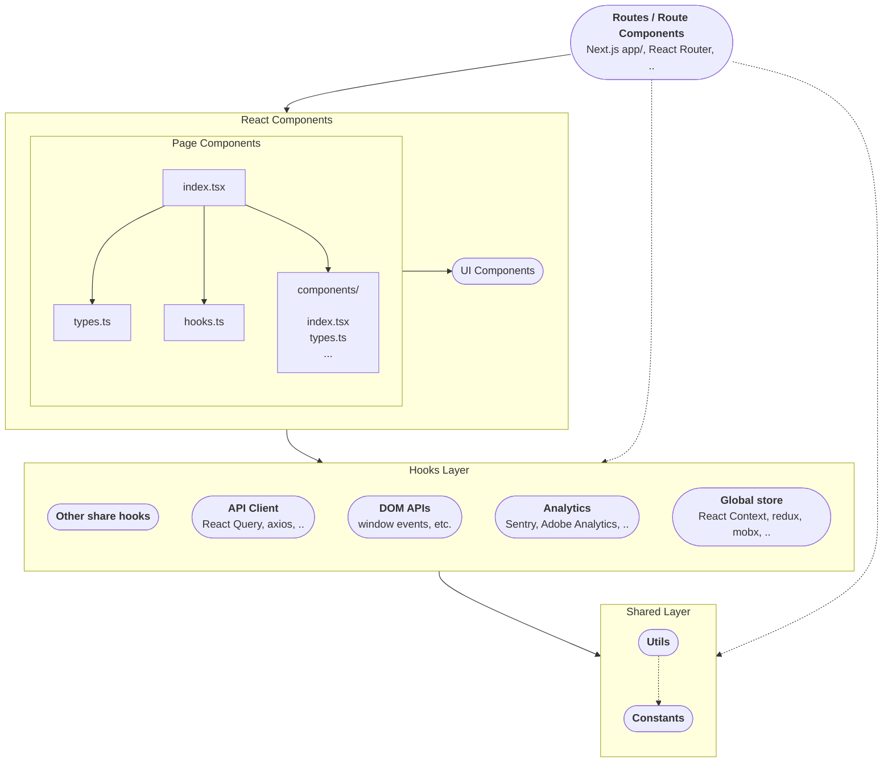

有效的自动化测试是任何企业级项目的必选项和质量根基。而实践已经证明，在前端仅做组件式的单元测试不够有效。本文将介绍一种更为有效的单元测试方式，让测试能够更好地支撑重构和开发。这套经验曾支撑笔者经历的一个年十亿美元级、历时五年+的交易系统的成功运营和维护演进。

## 太长不读——本文中心观点

正如我在5年前的[React单元测试策略及落地][react单元测试策略]中所说，自动化测试，而且是**有效的自动化测试**，**对于任何一个企业级项目来说都是必选项而不是可选项**。这是由企业项目的两个特点决定的：**人员流动不可避免**、**应用演进不可避免**。这两点不因人的主观意志为转移。应用演进，意味着新的、遗留的业务和代码会越来越多；人员流动，意味着物理上不可能会有一个人能长期、完全地掌握单个应用的所有上下文。因此，希望通过手工测试（开发者自测或者单独的QA团队手测）的方式来保障质量，首先既是低效的，长期来看也是不可能的。

那么，有了自动化测试就可以了吗？答案也不是。我见过许多无效的自动化测试，最痛的莫过于花费许多精力写了测试，却发现测试无法支撑重构，许多简单的重构比如React组件重命名、搬移数据到Context都会挂许多测试，直接对开发效能起负作用。其次，测试缺乏有表达力、有意义的断言，或者测试的描述与断言与真实业务场景脱节（测试断言的是页面上有没有“￥400”，关联的业务场景却是报价能否成功）等等，也都是常见的无效测试模式。这样的无效测试，都不能帮助你留存业务知识、支撑随时随地进行的技术重构，也无法真正助力软件质量和研发效能的提升，久而久之只会让测试变成一场表演，变成不得不应付而又弃之可惜的鸡肋。

你需要的是真正**有效的自动化测试**。

如果你是企业的中层技术管理者（Tech Lead或者Technical Principle等），那么这是你应该关注的问题；如果你是正在努力成为技术骨干的开发者，这篇文章也正是为你准备的。

接下来，我会介绍什么是有效的自动化测试，然后以一个React应用为背景，介绍一个常见且有效的测试策略是什么、作为关键部分的单元测试应该怎么架构、怎么编写，我会给出十分充足的代码样例帮助你和你的团队去落地。最后，我还会介绍这部分关键的单元测试方式有什么挑战，帮助你对这项技术知己知彼。

这套经验是我在过去三年、两个项目上的实践和总结。它成功地帮助我们能够在一个支撑行内年十亿美元级交易数额的应用上，历时5年+、还没上TS的情况下仍能自信地修改和重构代码；它也成功地帮助了我们当前的项目从0到1搭建起有效的测试策略，如今一个具有复杂逻辑的页面已经有4000行测试代码的有效覆盖。这篇文章是实践中诞生的经验和总结。

舞台已经搭好，下面让我们直奔主题~~直接开演~~。

> 🚧正文内容正在施工中。

## 目录

* 与上一版的变化
* 什么是无效的自动化测试？
* React架构与测试策略
* 测试架构、代码落地
* 新的衍生问题
* 总结：优势 & 挑战
* Q & A

> 🚧正文内容正在施工中。

## 与上一版的变化

如果你之前未读过我的前作[《React单元测试策略及落地》][react单元测试策略]，那么本节你自可跳过。

如果你是上一篇[《React单元测试策略及落地》][react单元测试策略]的读者，那么这里我为你快速总结了一下本篇相比于前篇的扬弃之处，以便你更快地理解本篇的架构和内容，并继续吸收上一篇中的精华部分。

在上一版中：

* “为什么要做(单元)测试”部分没有变化。有效的自动化测试仍然是**根本的质量保障**，这是因为人员流动和应用演进这两个因素对于企业级项目来说并没有改变。
* “什么是好的(单元)测试”这部分，上一篇提到的“不包含逻辑”、“运行速度快”这两点在本篇即将介绍的测试策略下需要*相对妥协*，目的是为了更好地支撑这个更本质的要求：支撑重构。
* “(单元)测试策略”这部分，给出了一个基于新React能力的架构，以及与之对应的新的测试策略。这个新策略，一方面是让测试更好地支撑重构，一方面也能在遗留系统/之前没有这类测试的项目更好地渐进式导入，比较适合历史包袱较重的项目。
  * 负责全局状态管理的action/reducer有了更轻量级的React Hooks和React Context因而不再是必选项了；
  * 负责派生数据计算的selector一部分可以挪到hooks里头，一部分可以合并到UI组件内部使用`useMemo`等，这层也没有了；
  * 负责副作用管理/编排的saga/thunk这块，其主要部分的API管理及其他部分都可以合并到hooks里头，这层也可以没有了；
  * 组件层，原来的策略是只测逻辑，新策略中建议是拉通hooks一起测，并且要测试页面内容。这是本篇最大的变化（和精华）。
* “(单元)测试落地”这部分，本篇给出了大量基于新的单元测试策略的代码。

## 什么是无效的自动化测试？/ 什么是有效的自动化测试？

那么，什么是有效的自动化测试呢？

* 支撑重构
* 

> 🚧从上一篇抄一些过来。

支撑重构的测试一直是我强调的一个最最重要的点。不能支撑重构的测试还留着过年吗？那么什么叫支撑重构的测试呢？

* 与当前测试相关的功能点变化了/改坏了，当前测试必须失败
* 与当前测试相关的功能点没变化/没改坏，但是内在的实现细节改变了，当前测试必须仍然通过
* 与当前测试无关的功能点变化了/改坏了，当前测试必须仍然通过，必须有其他测试失败

这么说是挺抽象的。我们直接来上手看几个例子。

* 断言细节与测试意图相差太远：不好调试、不好理解、挂了不知道咋回事、留不住业务上下文，除了刷覆盖率，对实际的代码质量、稳定性、后续维护基本是拖后腿的状态。
  * 不做精准断言，满篇都是`expect('一些字符').toBeInTheDocument()`。<有啥问题？①字如果是同样的/过于普遍（比如断言$20应该在页面上，鬼知道这啥意思？再者假设你是这么个应用，月付$20，年付只要$208(-32/↓15%)，你断言月付但其实年付也有$20，你改坏了月付，年付还在呢，测试不会挂，但是你的功能坏了。这就是所谓不支持重构的测试），哪哪都有，起不到测试效果；②看了就生气，测的这是啥；③不支持重构>
  * 断言太多细节，比如某个action有没有dispatch、某个mock是不是第n次被调用的时候是某个参数。<有啥问题？>

> 🚧从代码库里补点例子。

## React应用的常见架构 与 测试策略

> 🚧 ~~众所周知，~~测试策略是从应用架构中来的。对于一个React应用来说，除了UI组件之外，还会有全局状态管理（redux那套，action+reducer）、副作用管理（redux-thunk、saga、redux-observable那套）等东西，在新的React版本里，状态管理已经基本可以被更轻量级的React Context取代，副作用管理的大头、API请求也已经可以被React Query这样集成了全局状态管理功能的query库取代。新架构如下图：
> 
> 🚧架构图润色一下，Mermaid写着爽，看着丑。



> 🚧整个应用间的测试策略、乃至于整个架构（进程间）的测试策略，我放到[下一部分：React测试策略与落地（三）][react-testing-strategy-best-practice]来阐述。本篇的后续部分，我们来谈谈UI组件这部分单元测试的最佳实践。
> 
> 在React和前端这个上下文中，单元测试不是最优解——这也是我上一版测试策略推荐对组件的测试方式——集成式的单元测试才是。它有一些缺点：🚧（什么缺点）。🚧（讲一下那什么才是最优解）。
> 
> 讲一下黑马里关于发现问题的测试和定位问题的测试。
> 
> 但我无意发明新的名词，因此，本文所需的只是一个用来指代本文这样一种测试方式的指称。

* hook：hook的单元测试
* 其他层的测试：契约测试
* 使用React Query等global statement management的库
* 其他hook的测试：副作用，如windows、埋点等。

## 测试架构、代码落地

* 测试代码架构：API DSL（方便的API mock语法）+Fixture（mock数据）+tester（选择器）+expectations（测试断言）
* API mock & DSL
* 组件层tester沉淀和API设计
* 测试主体
  * UI内容断言
  * 用户行为交互
  * API Mock

```typescript
interface DropdownTester {
  getLabel(): string;
  getValue(): string;
  getDisplayText(): string;
}

export const findDropdown = (testId: string): DropdownTester => {
  const getElement = () => screen.getByTestId(testId)
  const getLabel = () => screen.getByTestId(`${testId}-dropdown-label`).textContent 
  const getValue = () => screen.getByTestId(`${testId}-dropdown-input`).getAttribute('value') 
  const getDisplayText = () => { return /* ... */ }

  return { getLabel, getValue, getDisplayText }
}
```

## 衍生问题

🚧施工中。

* 以什么为“页面”/单位？路由或页面组件（Page component）
* 跨“页面”的功能（比如用户改变了路由、跳到了另一个页面的一些功能等），用不用这套东西测？
* 测试文件过长：抽函数、放弃不必要的断言
* 测试文件如何组织：
  * 以功能组织，写的时候可能跨好几个`describe`/文件，难以发现、难以维护；
  * 以页面组织，容易很分散，看不出业务逻辑。
* 如何debug？

## 总结：优势 & 挑战

🚧施工中。

有什么好处？

* 支持重构：改功能时测试能有效保障行为、不需要改动相应的测试；
* 越写越顺手，组合式，写新测试相当容易；
* 测试断言声明式，有效留存业务上下文。

挑战是什么：一个有效的测试策略，以及编写测试的能力，来管理这些开发成本、维护成本。

* 有一定的开发成本——相比纯函数而言。
* 有一定的维护成本——需要保证测试间独立性（因为引入了API mock而不是组件级别的mock）、等
* 定位问题的能力相对“绝对的单元测试”有所降低。

## Q & A

> 🚧Q & A也正在施工中。欢迎跟作者先期提出你的实践困惑：[linesh.simpcity@gmail.com](mailto:linesh.simpcity@gmail.com)。

> 问题：为什么采用集成式测试组件的策略？MVVM分离为什么不行？
 
回答：不实际。有了Hooks以后，现代React组件其实就是个组合所有逻辑的地方，所有协调都在这里。

## References 

* testing pyramid 
* series from Jimmy

[^automated-tests-for-enterprise-only]: 对于个人项目，自动化测试乃至TDD实践是否必须只跟维护有关，你自己开心就行。

[react单元测试策略]: https://ethan.thoughtworkers.me/#/post/2018-07-13-react-unit-testing-strategy
[react-testing-strategy-best-practice]: https://ethan.thoughtworkers.me
