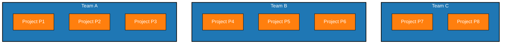

生意太火爆却不敢继续接单、技术团队拼尽全力仍面临产能瓶颈，如何破局？

去年底跟一位自己在开公司的朋友聊了聊他们在建设IT能力方面遇到的一些挑战，我梳理了一下问题和背景，脱敏分享出来，有兴趣的朋友可以想一想，如果由你来牵头解决这个问题，应该从哪里入手。

朋友公司是一家教育行业的科技公司，做K9少儿英语教育垂直领域的2B业务，业务范围主要是为培训机构交付游戏化的课件制作及培训软件等，产品形态以Mobile和Pad为主。团队不超过50人，总开发人员15人左右，主要使用的技术栈是Flutter、NodeJS、Cocos2D等。

公司接到（来自不同培训机构的）项目后，会把客户交给某一个团队全权对接。目前公司共有三个团队，每个团队都对接着两到三个客户的产品开发。每个团队都是全功能团队，配备前后端开发、业务分析师和设计师，业务复杂的团队配备有测试人员。但是开发者工程能力据说还有提升空间。每个团队都跑敏捷，两周一个迭代，上线周期则更长。偶尔也会请客户来参与showcase，看看中途开发的成果，提前反馈。

现在，双减放松后培训市场需求有所上升，原有培训机构存量已经不太足够满足市场需求，因此做2B生意的该公司生意也在增长，但是公司反而面临着产能不足的问题：有生意可接，但是反而怕接了做不完。这主要是由以下几方面的痛点引起的：

**痛点一：单个产品的开发周期太长**。目前，为单个客户交付产品的周期大约是6到9个月。且每个团队基本都已经接了2-3个客户和产品，产能已经基本接近饱和。

**痛点二：团队之间缺乏沟通，未能沉淀出可复用的代码或能力，存在重复造轮子的现象**。这多少也是第一个痛点的一个原因。但其实，公司创始人作为领域专家，认为团队间处理的业务、甚至在整个英语培训领域间，存在相当相似的模型，经过适当总结和提炼，让各团队复用并非没有可能。

**痛点三：加人也不能高效地解决问题**。各个团队未将配置和环境自动化，新人来了之后往往需要很长时间搭建环境（以周为单位）、熟悉项目上下文。此外，由于项目的周期性，当公司项目低谷时，新招的人员又不知如何安排，而招实习生或外包又担心需要额外的质量管控成本。总之，加人对项目效能的提升比不是线性的，公司很难找到一个依据回答“应不应该加人”、“应该至多加多少人才能产生预期效果”等问题来做决策。

先看第一个问题：单个产品的开发周期为什么长呢？据了解，有几方面的原因。一个是每个项目之间都互相独立，导致每次接到项目新起时都是重新开发，最多的复用也就是找以前的项目或其他团队拷贝一次代码库。很多基础设施（如项目架子、通用代码、CI/CD等）都需要重新做；一个是人工测试占用一定的时间，如果迭代与迭代间代码频繁出现回归问题，测试负担也会加重，开发侧也有rework，进而导致项目进度一定程度不可控。

再看第二个问题：团队之间缺乏沟通。这是因为目前实行的是团队负责制，一个团队完全负责一个产品，包括交付进度、技术栈、代码质量等，因此团队之间其实没有共同的硬性KPI和Deadline，也很难让其他团队匀出精力来处理外来团队的建议，因而团队之间也就很少沟通的必要。那么，我们在技术侧让各个团队的技术人员（比如技术领导Tech Lead之间的Scrum of TLs）定期沟通起来行不行呢？是可以的，公司也在开始这么做，不过又遇到TL们不知道这类定期会议的目的，在会议上只是发散分享，会后也不产生什么有用的改进措施，更遑论落地去执行。

最后是第三个问题：加人难以成为有效加产能的方式。这种问题一般预示着技术实践和工程能力的缺位，比如不能稳定地、自动化地一键构建开发环境，比如在中长周期中由于自动化测试的缺失使得回归缺陷开始出现并迟滞团队进展，比如业务和数据缺乏建模，比如代码缺乏分层、并且过多逻辑被堆积在前端而给服务沉淀带来困难……等等。

背景信息就是这么多。读者不妨也代入思考一下，这个问题让你来牵头解决，应该从何入手？采取什么步骤？

## 解决方案探索

首先要声明的是，以下的方案讨论都是思想实验，并未真正在我这朋友的公司中落地实行，也尚未产生实际的可衡量的改进效果。只是一个发散讨论的尝试。

这里面核心问题是产能矛盾：现有团队已经达到负荷，所有人都在赶项目，除了加人已经无法再承接新的业务需求，公司利润率达到临界点。无论是从提升人员能力、抽取可服用代码或服务等方面入手，都很难在不影响现有交付的情况下完成。有点像是飞机飞行过程中要加油，还要不影响现有航程的正常运行。但假设通过加人的方式为公司增加人手，**又需要通过什么步骤、如何使用人手，在未来的半年到一年的时间内，能提升公司的营收和利润呢**？

首先，人员能力的提升，根据我以往的培训经验，往往是个长时的过程。通过一到两个月的全脱产培训，往往可以也只能在10%的受训员工中找到动力较强、乐于改进的积极分子，将这些培训经验落实到项目上、甚至推广到项目外，往往需要更长的时间。因此，在半个月到一年的粒度中，能力提升能带来的改善效果，我其实也不是很确定，因此这项暂且按下不表。

很多人容易想到，缺乏可复用的代码或领域能力，也是导致项目之间、公司层面无法沉淀资产，并加速新项目交付的瓶颈所在。于是，一个很自然的想法就是，那么我需要构建一个跨团队的“平台”（Platform）——或者叫中台、工厂等，大概一个意思，这样各个团队在需要构建新产品时，可以从平台获得能力、加速研发。但是关于构建Platform一事，并非单纯的技术问题，而是会有一系列的问题需要解答：

1. Platform应该提供什么能力？以什么形式提供这些能力？
2. Platform是否应该是一个独立的团队？Platform成员应该如何抽调？
3. 如何确保Platform团队与产品团队的高效协作？比如说，产品团队觉得Platform可能拖累自己的交付时间线，或者觉得你搞出来的东西不好用、不符合产品团队的独特需要（产生了部门墙）等，怎么办？

以下是一些根据过往项目构建Platform的经验之谈：

> Platform应该提供什么能力？

这个实质上取决于企业情况不同，可能有不同的情形，比如说可以是一些项目启动脚手架的沉淀，可以是更偏DevOps能力的CI、CD、云原生的能力，也可以是领域建模并且以微服务形式暴露出去的业务能力（如API）等。

> Platform团队的形态与成员组成？

**至少必须要从旧团队抽调一些技术骨干来参与构建Platform**。这既是因为Platform为了完成赋能产品团队的任务必须高度了解产品的业务需求和技术需求，也有心理学方面的考量：有了原产品团队的参与，至于能部分减少“部门墙”现象的发生。

**Platform团队需要一个长期而稳定的负责人**。考虑到Platform必须频繁地参与许多产品团队的需求讨论和架构设计、统筹规划Platform发展路线、与各产品团队的技术侧合作确保重复的轮子由Platform来提供、将Platform当成产品运营并确保能以开发者友好的方式为各产品团队提供服务等，必须有一个人全职来保证Platform运行，确保各项活动得到贯彻和执行。同时，这个人需要有架构设计、领域建模、产品、工程实践等方面的能力和经验。

**除了Platform负责人以外的团队成员，最好有一定的轮换机制**。这是由Platform发展来源于一线产品需求的本质决定的。轮换有两个作用：一个是可以确保经常有一线产品团队来的同事带来业务背景、为Platform发展添砖加瓦；一个是Platform需求时多时少时可以通过轮换形成调节。

**参与Platform建设的人，也要接受Platform负责人的考核**。这也是过往项目的一个现象：团队成员轮换动力不足；轮换到Platform团队时并没有全力投入去做平台建设，轮换多少成为了形式。Platform的建设相当依赖于对其他产品团队需求的了解，Platform成员参与产品团队的需求讨论、技术方案讨论并综合Platform发展考虑对需求和技术方案提出建议，这些工作既与一般产品团队工作内容不太相同，也相当需要投入时间去做。在我的过往项目中并没有完全解决这个问题，而我事后认为的解决方案，就是需要让Platform建设者接受双重KPI考核。

> Platform团队与产品团队如何高效协作？

在原有背景下，一个可行的方式是，由Platform负责人先大致了解并规划好Platform的架构、需要的微服务等，然后先不动已有的或者已经在开发中的产品，而是选择一个新的项目，让团队在开发过程按照平台规划好的架子和服务往里面写代码。这样可以做到兼顾产品开发和Platform构建，之后再逐步地让新产品都迁移到Platform上来。

以上，便大致回答了步骤、选人、Platform工作重心等方面的内容。也欢迎读者分享下你们的想法。
