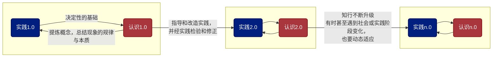

**实践是一切认识活动的基础。脱离了社会实践、不接受社会实践检验的认识和思想没有意义。而作为有效的获取直接经验的实践方法，就是刻意练习。**

几天前我做了一个梦，梦见每个人在出生前，都会在一些领域被赋予一些天赋，也都有一些领域完全没被眷顾，甚至还有负加成。在我的梦里，这个赋予天赋的场所是在一个中药铺，而每个领域的天赋是由一位专属的“老爷”来给予的。中药铺和老爷的意象，我猜想是因为我是一个对中国传统文化和辩证唯物主义有信仰的潮汕人，所以我既不是梦见有神论的上帝，也不是梦见主张每个人生来都是佛的菩萨。我梦见，哪位老爷愿意搭理你、愿意给你多少天赋，这都是随机的。在梦里愿意搭理我的老爷有几位：一位财神爷，说我此生大钱没有，小钱不发愁；一位文学爷，给我在文字上点了不少初生的天赋。搞笑的是，管体育的、管艺术的几位爷都不爱搭理我😂。

我觉得这个梦给了我不少启示。当我拿着这个梦跟大熊聊了一下时，大熊说，他始终不太相信天赋之说，他认为在一定智力水平之上，起决定作用的是问题意识和刻意练习。这及时地在玄学的路上给我拉了一把，也就有了这篇文章的主题：

> * 如何看待玄学的所谓“与生俱来”——也即先天决定、无法努力——的天赋？
> * 天赋与刻意练习的关系是什么？或者更唯物地说，认识与实践的关系是什么？

## 实践论

当我看到“认识和实践的关系是什么”这个问题时，我马上想到了教员的《实践论》。翻阅之后，我认为这篇文章一个很重要的观点就是：**人的所有认识活动，必须首先从实践中来**。而这个实践，是指社会生产实践——当然还有其他的科学实践和文化实践等等——说得再白一些，就是指通过劳动挣钱的实践。

简单来说，实践，就是人对各种事物的**感性接触**，它特指适合于当前社会关系的生产实践，以及相关的科学、文化、改造自然的实践等；认识，就是人对事物的**理性认识**，它超越了局部、经验和感官的认识，提炼总结出了与事物相关的概念，以及它们之间的规律与本质。

《实践论》的第一点，就是指出**实践是一切认识活动的基础**。**一切思想和认识的产生都要依赖于一线的社会生产实践**。也就是说，一切理性的、抽象的思想、理论和认识，都首先要从感性的、可触可感的具体事物、事件和实践材料中来，脱离了具体讨论（即实践）对象的理论，是没有意义的，因为它不是在认识具体的社会生产的事物（哪怕是文化事物呢），无从评判对与错，容易陷入空对空和自我感觉良好的认知中。

实践的阶段，要求多听多看多想，**材料要丰富（不片面）、要合乎实际（不主观）**。

实践的材料来源，可以是：
* 直接经验。也即一手参与社会实践的所感、所得、所想，是亲身的体会。
* 间接经验。可以是聊天、访谈、读书，甚至做梦等所得，是他人的经验为我所用。

我时常会跟一些信仰佛教的朋友交流，我觉得佛教徒中容易出现的一个问题，就是认识与实践脱离、甚至完全否定（社会）实践的作用，而完全追求灵性的体验。这与佛教在提倡此生要去贪嗔痴慢疑的基础上，还提出有来世、有六道轮回有一定的关系：既然人不止有这一生、而在六道之中（也即生而为人）本身就是苦的来源，那么人这一生最重要的任务，自然就不是参与社会实践、改造自然、改善自身生活条件，而是脱离这个轮回、完全摒弃此生的身体和物质享用。对于少部分已经深度参与了社会实践（也即很有钱、把自己的亲人甚至社会都照顾得很好了）的人来说，这种追求我觉得完全成立。但是，也有更大部分的人在自身不怎么参与社会实践的情况下，认为自己志愿是弘法利生，荷担如来家业。至于社会实践，是参与不了的，是拖修行后腿的。我认为，教员的实践论正指出的是这种思想的问题所在：脱离了社会实践的思想认识，是没有意义的。

《实践论》的第二点，是指出**任何从实践中诞生的认识，必须用于指导实践，其有效性必须接受实践的检验，并且随之修正或调整**。不能被实践证实或证伪的认识或思想，只是完成了一半，同样没什么意义。

这一套，就是辩证唯物主义的认识论。可以看出，它具有实践性、阶级性和革命性。它主张实践第一性，任何认识都必须扎根实践、从实践中来；它的价值主张是改造自然的社会生产实践，这是无产阶级的阶级立场；同时它主张自觉将从实践中得到的认识用于指导实践，并经受实践的检验。

这也回答了我关于天赋的问题：我还是认为个体在某些领域的一些先天禀赋确实存在。天赋可以是一种有点玄乎的间接经验，只不过，不管这种天赋存在与否，都需要通过踏实的社会实践——其具体方法，也就是下节要讲的刻意练习——来不断重复这种知与行的循环，进而使实践和理论水平都达到一个比较高的高度。这一套下来，有没有天赋其实都需要这样去做。那么可以说，天赋起到的不是对最终能力决定性的作用，而是在筛选可发展领域、决定最终上限上起作用。个体的时间总是有限的，不可能无限地在诸多领域投入刻意练习的时间，那么认识自己的天赋，就能让你找到一种顺应自然、事半功倍的效果。

## 刻意练习

搞清楚了为了什么而实践（社会生产）的问题，以及一切认识活动都应该扎根一线（社会生产）实践这个前提，那么下一个问题就是，如何有效地进行实践？

实践的感性认识，可以从直接经验中来，也可以从间接经验中来。间接经验，可以是通过唯物的访谈、读书等方法，甚至也可以通过玄学一些的做梦、顿悟等时刻。这里的访谈、读书都有对应的技巧，有另外的阅读材料，比如教员的《访谈的技术》、《如何阅读一本书》等等，本篇不再赘述。

直接经验方面，也即通过亲手了解、学习一样事物或技能上，主要遵循的是“刻意练习”的方法论。完善的阐述请参考原书[《刻意练习》](https://book.douban.com/subject/26895993/)，以下是我的阅读总结：

刻意练习的基础是**有目的的练习**：**`有目的的练习 = 训练目标明确 + 不断挑战舒适区 + 快速反馈 + 专注`**。这是一种你个人可以学习和控制的学习方法。这其中：

* 训练目标明确，指的是把总目标分解成更详细、可执行、可验收的目标。在编程领域即是/tw倡导的任务分解（Tasking）。
* 不断挑战舒适区，指的是每次练习目标要定在自己一次练习用尽全力刚好能达到的地方。实在不行就缩小步伐、向下调整目标，信心坚定，反复尝试以不断提高极限。
* 快速反馈，指的是对于自己每次练习要想方设法获得反馈：哪里做得好、哪里做得不够好、为什么做错、如何改正、如何监控改进进度等。这里面有些学习方法的设计和反馈也依赖于老师。
* 专注，如字面意思。不要一心二用，不边刷微信和视频。开始一次练习就在这30分钟内全力以赴。

而 **`刻意练习 = 有目的的练习 + 有效的心理表征 + 行业 + 导师 + 大量的练习`**。其中：

* 心理表征（Mental Representation）指的是你对这样事物的概念抽象以及其规律性本质性的理解，有点像教员讲的通过实践而得到的“认识”。
* 大量的练习，与投入时间高度正相关。心理表征我理解也可以是大量投入练习之后，自然而然产生的，决定因素也是投入时间，这都是个人可以控制的。
* 行业与导师，说白了就是时间上的技能和教学方法积累等。简化一下就是，学习一样技能，花钱找个好老师有助于加速你水平提高。

如此，我们就得到了一个正确的知行方法论，以及一个具体的实践路径。
